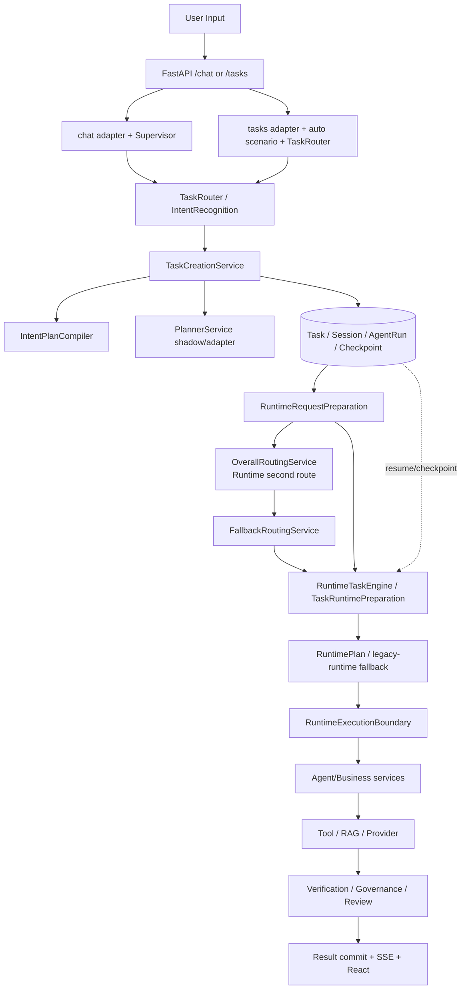

# Phase N0：基线漂移与控制面审计

> 状态：N0 审计完成（2026-08-23）
>
> 说明：本文件记录 Phase N 开始前的事实基线。工作树中已有 Phase M/案例 6 的未提交修改，N0 不将这些既有修改误判为 N 阶段回归。

## 1. 当前真实控制流



### 决策、执行与存储节点

| 类型 | 当前节点 | 事实 | 目标方向 |
| --- | --- | --- | --- |
| 决策 | `IntentRecognitionService`、`TaskRouter`、`Supervisor` | `/chat` 与 `/tasks` 都会触发独立的意图/路由判断；`Supervisor` 只是另一层包装 | 统一入口只产出 `GoalContract`；最终规划由 Planner 负责 |
| 决策 | `OverallRoutingService`、`FallbackRoutingService` | Runtime 准备阶段可以二次改写 route/agent，并触发上下文重复组装 | 移入 Planner 的受控 fallback policy；Runtime 不再重新理解目标 |
| 计划 | `IntentPlanCompiler`、`PlannerService` | 当前 Planner 主要把旧 route/intent plan 转成 CanonicalPlan，尚未成为生产计划所有者 | `GoalContract → Planner → CanonicalPlan` |
| 执行 | `RuntimeTaskEngine`、`TaskRuntimePreparation`、`RuntimeExecutionBoundary` | 同时支持业务服务计划和 `legacy-runtime:*` 固定工作流 | 单向执行 CanonicalPlan，旧 checkpoint 只兼容读取 |
| 执行 | Agent/Business services、RAG、Tool、Provider | 是实际能力执行边界，不应重新做目标/业务路由 | 由 Capability/Skill binding 解析 |
| 存储 | Task、Session、AgentRun、RuntimePlan、Checkpoint、SSE | 保持任务、恢复、事件顺序和审计证据 | 保持现有读取兼容，补充 GoalContract/CanonicalPlan lineage |

## 2. 重复职责与控制权风险

当前至少存在四种重复或交叉控制：

1. `/chat` 的 `Supervisor.prepare` 与 `/tasks` 的 `_bind_auto_scenario + TaskRouter.route` 都在入口进行目标/路由判断。
2. `TaskCreationService` 先编译 `IntentPlan`，再让 Planner 以旧 route/plan 为输入做 shadow 适配。
3. Runtime 准备阶段的 `OverallRoutingService`、fallback router 可以重写入口已选 route，并在重写后再次组装上下文。
4. Runtime 同时存在业务服务计划和 `legacy-runtime:*` 计划；Task 的 `agent_id` 仍然承担固定工作流选择的兼容语义。

这些重复不是单纯的类数量问题，而是“谁拥有最终 route/plan”尚未唯一确定。N1-N7 的验收必须以控制权和遥测为准，不能只看模块是否仍存在。

## 3. Phase M 五项失败分类

本次重新执行的基线命令：

```powershell
.venv\Scripts\python.exe -m pytest `
  apps/api/tests/test_commercial_scenario_cases.py `
  apps/api/tests/test_commercial_scenario_preflight.py `
  apps/api/tests/test_embedding_compatibility.py `
  apps/api/tests/test_external_source_registry.py `
  apps/api/tests/test_unified_web_ui.py `
  -q --no-cov --tb=short
```

初始结果：`5 failed, 41 passed`（拆分运行；另一次合并运行也确认 5 项失败）。
修复后的 N0 回归：`49 passed, 2 warnings`。

| baseline failure | 分类 | 证据 | 处理结论 |
| --- | --- | --- | --- |
| commercial scenario coverage | 意图扩展后的真实评估覆盖缺口，不是简单数量漂移 | `config/scenarios.yaml` 已启用 9 个场景；`six_scenarios.yaml` 只有 8 个 case，缺 `academic_text_diagnostic_solver_v1` 与 `rubric_generation_v1` | N0 补齐评估条目并让校验器覆盖新场景 |
| commercial scenario count/preflight | 旧数量断言 + 目录扩展 | 当前 case catalog 为 8 条，其中 `research_data_workbench_v1` 明确 disabled；启用 case 为 7 条；测试仍断言 6/5 | N0 改为基于 enabled catalog 的语义断言，不固定旧数字；补齐两条 case 后应为 10/9 |
| external source registry count | 已发布外部来源能力扩展后的旧数量断言 | `validate_external_sources.py` 当前报告 `source_count=11`、`scenarios_with_external_path=10`；配置中的全部场景均声明外部证据路径 | N0 保留完整性/人工复核/metadata-only 断言，数量与目录派生，不恢复旧数字 |
| local text model compatibility | stale fixture，不是当前生产路径绕过离线约束 | 生产实现调用 `transformers.AutoTokenizer/AutoModel.from_pretrained(..., local_files_only=True)`；失败栈显示 HF 缓存未命中后按离线模式拒绝联网；测试仍只注入 `sentence_transformers.SentenceTransformer` | N0 更新 fixture 以覆盖当前 Transformers 接口，并继续断言 `local_files_only=True` |
| demo scenario count assertion | API 语义扩展后的旧数量断言 | `/api/v1/scenarios` 返回 9 个 enabled scenario；React 工作台仍固定 6 个 showcase cards；测试将 API 目录误当成 5 个演示场景 | N0 断言六个 showcase ID、禁用场景不可见和 presentation contracts，不断言旧总数 |

### N0 状态字段

```yaml
baseline_failures:
  - commercial_scenario_coverage
  - commercial_scenario_count_preflight
  - external_source_registry_count
  - local_text_model_compatibility
  - demo_scenario_count_assertion
resolved_before_n:
  - react_workspace_and_six_showcase_layout
  - markdown_katex_unified_rendering
  - ac01_real_image_upload_chain
  - tp01_waiting_review_boundary
accepted_known_failures: []
reason: >-
  The five reported failures are either stale assertions/fixtures or an explicit
  evaluation catalog coverage gap. They are being resolved in N0 without
  weakening provider, review, or disabled-scenario boundaries.
evidence:
  - config/scenarios.yaml
  - evaluation/cases/commercial_scenarios/six_scenarios.yaml
  - scripts/validate_commercial_scenarios.py
  - scripts/validate_external_sources.py
  - apps/api/app/services/rag_providers.py
  - apps/api/tests/test_embedding_compatibility.py
  - apps/api/tests/test_goal_contract.py
  - apps/api/tests/test_planner_authoritative.py
```

## 4. ControlOwnerMatrix

| component | authority | can_change_route | can_change_plan | production_enabled | target_status | removal_condition |
| --- | --- | ---:| ---:| ---:| --- | --- |
| Unified ingress (target) | normalize identity, modality, evidence and safety | no | no | not yet | KEEP / introduce N1 | both `/chat` and `/tasks` emit equivalent GoalContract |
| `Supervisor` | current `/chat` request preparation wrapper | yes, through TaskRouter | no | yes on `/chat` | MERGE into unified ingress compatibility adapter | no production endpoint depends on Supervisor-only goal interpretation |
| `TaskRouter` | current deterministic intent/agent route owner | yes | indirectly | yes | FREEZE then COMPATIBILITY | Planner owns route/capability and preflight telemetry reaches zero |
| `IntentPlanCompiler` | current default IntentPlan owner | no | yes | yes | FREEZE then REMOVE from production | old checkpoint/legacy import adapter is the only remaining use |
| `PlannerService` | current shadow adapter; target authoritative plan owner | target yes | target yes | shadow/flagged | KEEP / upgrade N2 | N9 active mode is default and canonical plan is persisted |
| `OverallRoutingService` | Runtime second router | yes | no | yes | REMOVE from runtime | no runtime preparation injection and rewrite counter is zero |
| `FallbackRoutingService` | Runtime route fallback | yes | indirectly | yes | MERGE into Planner policy | fallback route counter is zero and Planner fail-closed policy is covered |
| `RuntimeRequestPreparation` | current context + route refinement + execution-plan bridge | yes | yes via compiler | yes | KEEP / simplify N4-N6 | accepts canonical plan without route mutation or second context assembly |
| `RuntimeBusinessRegistry` | fixed `agent_id` → business service resolution | indirectly | yes | yes | MERGE into capability/skill binding | execution resolves target binding from CanonicalPlan; agent ID is compatibility alias only |
| `legacy-runtime:*` | fixed workflow fallback execution | no | yes | compatibility path | REMOVE from production | invocation counter zero and old checkpoint reader tests pass |
| `scenario_catalog` | scenario hints, constraints, presentation/evidence metadata | no (target) | no (target) | yes | KEEP / demote to hint metadata | semantic tests prove scenario cannot force final Agent/workflow |
| Agent registry / internal hub | capability implementation and provider metadata | no | no | yes | KEEP | all production targets are registry-resolved and fail closed when unregistered |

## 5. Telemetry baseline and required counters

当前 metrics 输出包含任务、模型、队列和 trace 指标，但没有以下控制面计数器。N0-N2 必须补齐统一命名，并在 N5-N9 用它们作退休门槛：

| counter | current baseline | increment point | retirement gate |
| --- | ---:| --- | --- |
| `taskrouter_final_route_count` | missing | only when legacy preflight returns final compatibility route | N6/N9 = 0 in active production |
| `overall_router_rewrite_count` | missing | every `OverallRoutingService` route rewrite | N6 = 0 |
| `planner_shadow_count` | missing | Planner build in `shadow` mode | retained for comparison, not production ownership |
| `planner_controlled_count` | missing | Planner build in `controlled` mode | N5 evidence available |
| `planner_active_count` | missing | Planner build in `active` mode | N9 covers all production tasks |
| `legacy_runtime_invocation_count` | missing | `legacy-runtime:*` execution branch | N7/N9 = 0 |
| `fixed_agent_route_count` | missing | compatibility route resolves a fixed Agent workflow | N7/N9 = 0 |
| `fallback_route_count` | missing | route fallback changes selected target | N6/N9 = 0; Planner fail-closed instead |

### Telemetry acceptance

N0 只建立审计和命名，不把“没有计数器”解释为“没有调用”。在计数器接入前，旧路径的实际调用必须通过结构化 trace 或测试桩补证；任何 N5-N9 的“零”都必须来自运行时计数和静态引用审计两者。

## 6. N0 退出条件

- 五项失败均完成语义分类并已消除；
- 商业评估目录与 enabled scenario 集合一致（10 条评估记录，9 条启用执行路径，1 条冻结路径）；
- 外部来源测试不依赖旧数量，仍强制 metadata-only 与人工复核；
- Embedding fixture 覆盖当前离线加载接口并继续断言 `local_files_only=True`；
- Demo API 测试区分目录数量与六案例展示数量；
- `GoalContract`、权威 Planner 计划、能力绑定和八项遥测命名已固定；
- 本阶段不提交、不 push，代码变更继续留在工作树，待 N10 一次性收口。
