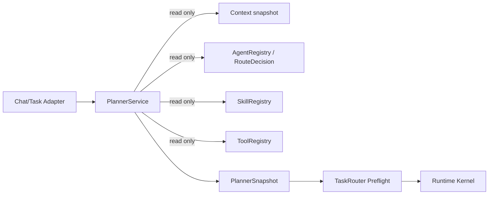

# Phase B1：Planner Owner 与依赖边界

## 唯一 Owner

`PlannerService` 是未来 Goal Understanding、候选能力选择和 Canonical Plan Proposal 的唯一智能入口。当前实现以现有 deterministic `RouteDecision` 为兼容输入，先建立版本化 snapshot，不执行 Provider/Tool/RAG。

## 依赖规则

| 模块 | Planner 可做 | Planner 不可做 |
| --- | --- | --- |
| Supervisor | 消费标准化 request/trace identity | 新增课程/意图/Agent 智能规则 |
| TaskRouter | 接收候选并做 deterministic preflight | 被 Planner 绕过、执行模型路由 |
| AgentRegistry | 读取版本、发布、能力和可用性快照 | 修改注册表、发布 Agent |
| SkillRegistry | 读取当前 descriptor（Phase B 只保留接口） | 创建 SkillRetriever 或写 Skill Memory |
| ToolRegistry | 读取工具 descriptor、风险和 budget | 调用 Tool |
| Runtime | 接收固定 Canonical/Runtime Plan | 重新理解 Goal 或重写 Planner snapshot |
| Session/Memory | 读取受限 context summary | 直接写 Session Memory |

## Feature flags

- `PLANNER_SHADOW_ENABLED=false`：默认关闭；开启后只写 `_planner_snapshot` 和既有 `plan.created` metadata。
- `PLANNER_TAKEOVER_ENABLED=false`：默认关闭；只允许 allowlist Agent/Scenario 进入受控 takeover。
- `PLANNER_CANARY_AGENT_IDS`、`PLANNER_CANARY_SCENARIO_IDS`：双重 allowlist，空值不授权生产 takeover。

Planner failure、invalid snapshot、preflight rejection 均回到旧 route。Planner snapshot 的 `mode=takeover` 只在显式 flag 和 allowlist 同时满足时出现。
