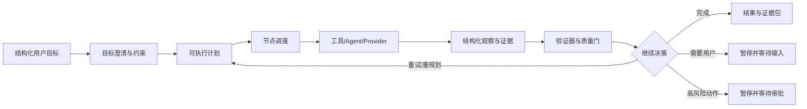

# True Agent Runtime 长期演进路线

状态：长期目标执行中

## 1. 目标定义

将项目从“根据意图选择一条固定业务链并返回答案”的编排平台，演进为一个可恢复、可观测、可评测的 Agent Runtime：

并行开发与多 Agent 分工规范见
[`docs/architecture/runtime_parallel_workflow.md`](./runtime_parallel_workflow.md)。



“真正的 Agent”在本项目中的最低判定标准不是使用了哪个模型，而是同一个运行实例必须具备：

1. 明确的目标、约束、成功标准和预算。
2. 可持久化的计划、节点状态、观察、证据引用和 checkpoint。
3. 节点级工具、Provider、内部 Agent 和子 Agent 调用边界。
4. `observe -> decide -> act -> verify -> replan` 闭环，而不是只执行一次固定流水线。
5. 失败、超时、重试、依赖阻塞、暂停、恢复、取消和人工审批语义。
6. 可重放事件、SSE 顺序/重连保证、trace 和离线评测集。

## 2. 当前判断

当前系统已经有 Agent Registry、Task/SSE、Provider、RAG、内部 Agent、LangGraph 和若干业务工作流，但核心控制权仍集中在大型 `TaskRunner` 及各业务 Service 中：

- `IntentPlanCompiler` 主要生成计划元数据，计划节点尚未成为通用执行单元。
- 研究链中，检索、审阅、修正和生成存在组合式调用；直接执行旧计划会造成 Provider 重复调用。
- 工具 Registry 具备声明信息，但缺少统一的输入校验、权限、预算、超时、重试和结果契约。
- LangGraph 生产路径仍需从进程内 checkpoint 迁移到数据库持久化运行状态。
- 现有 Task/SSE/Provider 边界是稳定资产，不能为了“Agent 化”一次性推倒重来。

因此迁移策略是“运行时先行、业务路径逐条接入、旧路径可回退”，而不是重写 `TaskRunner`。

## 3. 目标分层

### L0：兼容层

保留现有 Task API、Task 创建非阻塞约束、SSE 事件协议、Provider 认证方式、既有 Agent Registry 和冻结的 `SOLVER_CT v1.0`。

### L1：Runtime Kernel

统一提供：

- `AgentRun`、`AgentRunPlan`、`RuntimeNode`、`RuntimeObservation`、`RuntimeDecision`。
- 确定性的状态机和 DAG 依赖调度。
- 节点超时、重试、失败传播和并发上限。
- checkpoint hook、事件 hook 和结构化错误码。

当前已建立 L1 的基础实现，包括按决策选择节点的执行器、预算消耗、失败传播和
`RuntimeController` 闭环，但尚未接入生产 TaskRunner。

### L2：Durable Run Service

新增 Run Repository 和恢复入口：

- `agent_runs`：运行快照、计划版本、迭代次数、预算和终止原因。
- `agent_run_nodes`：每个节点的状态、尝试次数、错误和观察引用。
- `agent_checkpoints`：单调序列、状态版本和可重放快照。
- `resume(run_id)`：从最近 checkpoint 继续，而不是重新创建任务。
- 乐观锁：`state_version` 防止重复 worker 同时推进同一个 run。

数据库变更只允许新增增量 migration，不修改已提交 migration。

### L3：Tool/Agent Runtime

所有可执行能力统一为受控 handler：

```text
handler_id
  -> 输入 schema
  -> 权限/风险级别
  -> 预算类型
  -> timeout/retry policy
  -> provider 或本地实现
  -> RuntimeObservation
```

Provider 只负责外部调用；Runtime 负责何时调用、调用几次、失败怎么办、结果是否足够继续。

### L4：Controller Loop

将模型或规则控制器限制为结构化决策输出：

- `execute(node_ids)`
- `replan(reason_codes)`
- `ask_user(user_prompt)`
- `request_approval(approval_scope)`
- `finish`
- `fail`

控制器只能引用已注册的 node/handler，不能直接执行任意 Python、任意 URL 或未发布 Agent。

### L5：质量、治理和评测

每个业务 Agent 都必须有：

- 成功标准和验证器。
- 证据/引用完整性检查。
- 工具调用、模型调用、重规划次数和耗时指标。
- golden cases、失败 cases、越权 cases 和回归阈值。
- mock 与真实 Provider 结果的明确标记。

## 4. 分阶段执行计划

### Phase 0：基线冻结与观测（已完成）

- 记录现有 Task、SSE、Provider、Registry 和研究链入口。
- 明确 `SOLVER_CT v1.0` 只读。
- 把“固定流程”和“真正 Agent”能力差异写入架构文档。

退出条件：已有业务链可回归，未发生 Provider/凭据边界变化。

### Phase 1：Runtime Contracts（已完成）

- 建立结构化 Run/Plan/Node/Observation/Decision/Budget 契约。
- 计划构造时校验重复节点、未知依赖和环。
- 建立纯状态机，不在状态机内执行 IO 或 Provider。
- 建立存储无关的 `PlanExecutor`。

退出条件：状态转移、依赖推进、暂停/审批、重试、超时和失败传播有单元测试。

### Phase 2：Durable Checkpoint（当前阶段）

执行顺序：

1. 完成 `AgentRunRepository`，实现 run/node/checkpoint 的读写和 `state_version` 乐观锁。
2. 将 Runtime 状态转换为数据库模型，并限制持久化内容为结构化状态、指标和引用，不保存隐藏思维链。
3. 建立 `RuntimeEventBridge`，把 node 事件映射到现有 Task/SSE，保证旧客户端仍能工作。
4. 增加断点恢复、重复投递、并发 worker 和 SSE 重连测试。
5. 将生产 LangGraph checkpoint 从进程内实现切换到受支持的持久化 backend；在迁移完成前不得宣称生产可恢复。

Runtime Controller 已支持 `execute/replan/ask_user/request_approval/finish/fail`，
并在每次执行前消耗模型、工具或子 Agent 预算；这组能力目前有单元测试，但仍需
通过 Task/SSE 生命周期和真实业务 Handler 进行集成验证。

退出条件：杀掉 worker 后可以从最近 checkpoint 继续；同一个节点不会因重复投递产生不可接受的副作用。

### Phase 3：Tool/Agent Handler Registry

执行顺序：

1. 从现有工具 Registry 生成 Runtime handler descriptor。
2. 为工具补充 input/output schema、权限、风险等级、预算计数和幂等键。
3. 先接入纯本地、无副作用工具，再接入检索和 Provider。
4. 将内部 Agent 封装为 `subagent` handler，限制最大深度、预算和递归次数。
5. 对外部副作用操作默认要求人工审批。

退出条件：新增工具只需注册 descriptor 和 handler，不需要修改 TaskRunner 分支。

### Phase 4：研究 Agent 试点

研究场景作为第一个闭环 Agent，但必须先拆分现有复合逻辑：

```text
目标澄清
  -> 检索计划
  -> 外部检索
  -> 证据去重/质量检查
  -> 论文审阅
  -> 缺口判断
  -> 追加检索或重规划
  -> 研究简报
  -> 引用/格式验证
```

迁移规则：

- 不直接把旧的三节点元数据计划重新执行，因为 `_retrieve_external()` 已经包含规划、搜索、审阅和修正。
- 先把旧复合链封装成一个兼容 handler，证明 Runtime 能承载现有结果。
- 再逐步拆出独立 handler，每拆一个就增加“不重复 Provider 调用”和结果等价测试。
- 只有已发布且 Flow ID 配置完整的 Agent 才能执行真实星辰调用。

退出条件：研究任务能在至少一次观察不足时触发重规划，并留下完整证据链和可恢复 checkpoint。

### Phase 5：教学/学习 Agent 迁移

- 将教学目标、学习者状态、待办和质量门纳入 Run context。
- 将“回答问题”与“推进学习目标”分开，后者必须有下一步行动或验证。
- 接入人工教师审批节点和用户补充信息节点。
- 与 `SOLVER_CT_V1` 保持适配器边界，不修改冻结实现。

退出条件：至少一个教学场景能够根据学生反馈调整计划，而不是只重新生成文本。

### Phase 6：评测与治理产品化

- 建立 run replay、trace 检索和失败节点诊断。
- 建立离线评测：目标完成率、证据正确率、引用完整率、重规划成功率、无效调用率、预算遵守率和恢复成功率。
- 增加越权、提示注入、工具参数污染、敏感信息泄露和 Provider 不可用测试。
- 对每个 Agent 保存 plan version、handler version、model/provider 配置和评测版本。

退出条件：任何 Agent 发布都必须通过配置校验、回归评测、安全检查和可回滚验证。

### Phase 7：默认 Agent Runtime（长期终点）

- 新业务默认通过 Runtime 创建 Run，不再新增大型 TaskRunner 分支。
- 旧工作流保留兼容适配器，并逐步降级为 handler 实现。
- TaskRunner 负责兼容 API、队列和生命周期；Runtime 负责计划、执行、观察、决策和恢复。
- 生产运行必须具备持久化 checkpoint、事件重放、预算限制和可观测 trace。

## 5. 本阶段的实现边界

本阶段允许：

- 新增 Runtime 包、数据库增量 migration、Repository、事件桥接和测试。
- 将旧计划转换为 Runtime 计划的适配器。
- 接入不重复执行 Provider 的兼容 handler。

本阶段禁止：

- 直接重写或修改 `SOLVER_CT v1.0`。
- 在路由中同步执行 Provider，破坏任务创建非阻塞约束。
- 把原始星辰 YAML、真实 API key、Bearer token 或学生隐私写入仓库。
- 用一次成功的 mock 结果替代真实 Provider 验证。
- 在没有 checkpoint、幂等策略和 SSE 测试的情况下切换生产默认路径。

## 6. Definition of Done

当以下条件全部满足时，项目才可称为“真正的 Agent Runtime”：

1. 一个 Run 可以跨多个节点、多个迭代和至少一次重规划完成目标。
2. 节点状态、观察、证据引用、预算和决策可从数据库恢复。
3. worker 崩溃、超时、临时 Provider 失败和用户等待都不会丢失运行语义。
4. 工具/Agent 调用受注册表、权限、预算、超时和风险策略约束。
5. 结果经过可执行的验证器，而不是只依赖最终模型文本。
6. 用户可以看到稳定的进度事件，并能从断点继续或提供输入/审批。
7. 每个生产 Agent 都有可重放 trace、离线评测和回滚版本。

## 7. 当前下一步

下一步只实现 Phase 2 的 Repository 与事件桥接，不接入真实 Provider：

1. 设计 `AgentRunRepository` 接口和 SQLAlchemy 实现。
2. 给 `PlanExecutor` 增加 checkpoint 序列与状态版本写入。
3. 将 `node_started/completed/retrying/failed` 映射为现有 `AgentEventType`。
4. 增加恢复测试，证明恢复后不会重新执行已成功节点。
5. 选择一个“无重复调用”的研究兼容 handler 作为首个试点。

当前已增加 `AGENT_RUNTIME_SHADOW_ENABLED` 配置。开启后，旧 TaskRunner 会为每个任务
创建一个明确标记为 `legacy.task_runner.*` 的兼容 Runtime Run，并在任务完成、失败或
取消时写入终态 checkpoint；该模式只记录生命周期，不重新调用 Provider，也不改变旧
Task/SSE 结果。下一步是把这个单一兼容节点替换为真实的研究 Handler DAG。

## Current implementation checkpoint (2026-08-08)

Continued checkpoint: recovery now exposes an explicit `/tasks/{task_id}/reconcile` control for paused, non-replay-safe in-flight nodes. The operation records a bounded human-confirmed observation, preserves the execution key, increments the durable checkpoint, and resumes without implicitly replaying the side effect. Versioned offline evaluation cases are available under `evaluation/runtime_cases/`, with `scripts/evaluate_runtime_trace.py` providing an audit-and-evaluate CLI that never invokes a Provider, tool, or model.

Runtime checkpoints now also carry a serialized request snapshot. A resumed
worker uses the snapshot produced after route/context preparation instead of
blindly reconstructing from the original Task payload. Resumed user input is
exposed to Runtime request adapters and the Research Analysis handler, while
one-shot approval grants are cleared after consumption so they cannot leak to
later approval gates.

Generic Provider and SubAgent adapters now receive bounded `runtime_context`
for declared dependency nodes, including status, error code, facts, artifact
ids, evidence ids, and warnings. This keeps the observe-to-decide handoff
explicit and machine-readable without persisting hidden chain-of-thought.

`RuntimeExecutionBoundary` now owns Runtime request restoration, plan
selection, Run start/restore, business Runtime dispatch, and finalization.
TaskRunner still owns legacy routing/retrieval/presentation for compatibility,
but new Runtime lifecycle calls no longer need to be embedded directly in
that legacy flow.

When a supported Runtime plan is selected, TaskRunner now dispatches it before
the legacy retrieval/provider execution branch. The legacy branch is skipped
for that run, while the existing validation, artifact, session, Task, and SSE
presentation boundary remains in place. This is the first real business-path
migration rather than a shadow-only Runtime envelope.

The runtime kernel, durable run/node/checkpoint repository, task-event bridge, handler registry, and compatibility envelope are implemented. The default production path remains unchanged when `AGENT_RUNTIME_SHADOW_ENABLED=false`.

The first opt-in business DAG is Research Analysis V2. Enable both `AGENT_RUNTIME_SHADOW_ENABLED=true` and `AGENT_RUNTIME_RESEARCH_ENABLED=true` only in a controlled environment. It executes through `analysis.execute -> analysis.verify`, persists runtime checkpoints from the worker context, and emits node events through the existing Task/SSE event contract.

The durable control gate is now implemented through persisted `control_request` and `control_data` fields, cooperative Runtime pause handling, user-input submission through `/tasks/{task_id}/input`, and `/tasks/{task_id}/pause`, `/resume`, and `/approve` endpoints. Runtime handlers now have generic adapters for registered tools, the configured Provider, and internal Agents; side-effecting handlers require approval before invocation.

Research Analysis V2 now exercises the observe -> decide -> act -> verify -> replan loop: a failed verification can produce a new plan iteration while preserving the same Run and budget. Runtime traces can be audited and evaluated offline with `app.runtime.replay` and `scripts/audit_runtime_trace.py`, without invoking a Provider.

Phase 5/6 work is still in progress. Runtime suspension now exits the worker without converting `waiting_input`, `waiting_approval`, or `paused` into task failure; research results can be reconstructed from durable observations after restart. The remaining gates are richer event ordering/reconnect coverage, a versioned evaluation corpus, and the TaskRunner resume fast path.
Runtime node states now persist a stable execution key and effect status. Handler descriptors declare `side_effecting` and `replay_safe`; safe handlers may be replayed with the same key, while an in-flight non-replay-safe side effect is paused with `in_flight_execution_requires_reconciliation` instead of being invoked a second time. This safety policy is persisted by migration `20260808_0019`.

The current resume path skips repeated overall routing, context assembly, external retrieval, and RAG retrieval when a queued task resumes from a waiting Runtime state. The remaining optimization is to split TaskRunner's compatibility preparation from Runtime execution and result presentation more cleanly, so all already-checkpointed preparation can be bypassed without relying on legacy local variables. No real Xingchen flow is enabled by this change.

The first result-pipeline extraction is now in place through
`TaskResultPresentationService`. Deterministic business rendering, execution and
evidence views, math formatting, and Artifact answer synchronization are now a
reusable post-validation boundary. TaskRunner still owns the surrounding
transaction and session/memory persistence for compatibility, but Runtime
business execution no longer needs to grow another copy of these presentation
rules. The next extraction target is the durable result commit boundary:
Task/Session/Artifact/AgentRun/event writes should become an explicit adapter
that can be called by both Runtime and legacy compatibility runs.

The durable Task/Artifact/AgentRun/event portion is now extracted as
`TaskResultCommitService`. It preserves the existing Task and SSE event contract,
including Runtime finalization and Artifact-created events, while removing that
write protocol from the main TaskRunner execution method. Session context,
memory, and compaction remain in TaskRunner until their side effects have an
explicit idempotency/recovery contract.

Session-facing terminal effects are now isolated in
`TaskSessionCommitService`. The existing assistant message uniqueness boundary
is used as the durable commit marker for the whole group: Session continuity,
working state, initial learning attempt/outcome, explicit memory handling, and
assistant/system messages are skipped on a replay after the assistant message
is present. This is covered by a direct replay test and keeps the existing
same-transaction behavior for the first commit. Background summary generation
remains separately guarded by its covered-through sequence rule.

Runtime business selection is now Registry-driven through
`RuntimeBusinessRegistry` rather than a Research Analysis conditional inside
the execution boundary. The second opt-in capability is General Question V1:
with `AGENT_RUNTIME_SHADOW_ENABLED=true`, `AGENT_RUNTIME_GENERAL_ENABLED=true`,
and `general_question_runtime.execute=true`, it runs through
`general.execute -> general.verify`, including a bounded replan on an invalid
or failed answer. The original route, Provider, Task, and SSE contracts remain
the compatibility boundary, and the new general Runtime flag defaults off.

The third opt-in capability is now Lesson Prep V1 through
`LessonPrepRuntimeService`. It reuses the same Registry-driven execution,
verification, user-input, checkpoint, and bounded replan kernel instead of
creating a teaching-specific loop in TaskRunner. With
`AGENT_RUNTIME_SHADOW_ENABLED=true`, `AGENT_RUNTIME_TEACHING_ENABLED=true`,
and `lesson_prep_runtime.execute=true`, the path runs through
`lesson.execute -> lesson.verify`. Verification requires the structured
teaching contract (`learning_objectives`, `lesson_flow`, `activities`, and
`formative_assessment`), so a non-empty model response alone cannot finish the
Run. The default remains off and the existing teaching route remains the
compatibility fallback.

This checkpoint establishes a reusable migration pattern for additional
business capabilities: a small Registry service declares support and plan
metadata, a handler adapter performs the business call, a domain verifier
decides whether the goal is met, and a bounded replan preserves the same Run
and budget. The next migration target is the interactive teaching path, where
student feedback and teacher approval must become explicit Runtime
observations and control requests rather than hidden conversational state.

The interactive teaching migration has now started with
`TeachingInteractionRuntimeService`. Phase 2 actions (`request_more_hint`,
`submit_check_response`, and `switch_to_direct_answer`) can be executed as a
separate durable `teaching_interaction` Run with
`teaching.feedback.observe -> teaching.feedback.apply ->
teaching.feedback.verify`. The mutating action is declared non-replay-safe,
so a checkpointed in-flight action cannot be replayed blindly. When the
verification scope requires human review, the Run stops at an explicit
approval-gated node and can be resumed through
`POST /api/v1/learning/runtime/{run_id}/approve`; the original learning action
idempotency record is updated only after the Runtime reaches completion.
This is opt-in through `AGENT_RUNTIME_TEACHING_INTERACTION_ENABLED` and keeps
the existing `/learning/actions` behavior as the default fallback.

Learning progress is now the next opt-in Runtime capability through
`LearningProgressRuntimeService`. Phase 3 actions (`submit_attempt_revision`,
`start_retest`, `complete_retest`, and `dismiss_retest`) are represented as
`learning.progress.observe -> learning.progress.apply ->
learning.progress.verify`, with the existing attempt, feedback-uptake,
mastery-evidence, and retest policy reused inside the non-replay-safe apply
boundary. The verification node records bounded attempt status, feedback
uptake status, mastery evidence count, and retest-plan count; an indeterminate
or manual-review result pauses at an approval-gated node and resumes through
the same learning Runtime approval endpoint. Enable this migration with
`AGENT_RUNTIME_LEARNING_PROGRESS_ENABLED=true`; the legacy phase-3 path
remains the default fallback while the next work focuses on splitting
TaskRunner recovery preparation from finalization and migrating more
goal-directed replanning decisions into Registry-owned plans.

TaskRunner resume preparation now restores the serialized execution plan and
Runtime plan from the checkpointed request/Run instead of rebuilding them from
the legacy route path. Resumed Runs also skip route-refinement progress events
and intent-plan start events, preventing a recovery from looking like a new
route decision. If an older snapshot lacks a valid execution-plan payload, the
existing deterministic planner remains a compatibility fallback. This is an
incremental fast path; the remaining work is to move Runtime execution and
terminal presentation into an explicit boundary so the large legacy pipeline
cannot accidentally run on a Runtime-only resume.

General Question V1 now has separate auto and canary gates. When
`AGENT_RUNTIME_GENERAL_ENABLED=true`,
`AGENT_RUNTIME_GENERAL_AUTO_ENABLED=true`, and the evaluated
`AGENT_RUNTIME_GENERAL_CANARY_ENABLED=true`, a normal route to
`GENERAL_QUESTION_V1` becomes a Runtime candidate even without callers adding
`general_question_runtime.execute=true`. An explicit `execute=false` still
opts out, and all three flags remain false by default. This is the first route-level
default migration candidate; it can be canaried independently from the
legacy general-question service and is covered by a normal-route Runtime
integration test.

The terminal compatibility protocol is now explicit in
`TaskTerminalBoundary`. Both legacy TaskRunner results and Runtime business
results pass through the same presentation, Session idempotency, Artifact,
AgentRun, Task status, and completion-event sequence. TaskRunner retains only
pipeline-specific validation and metric preparation before delegating the
terminal commit. This makes the next migration step safer: a Runtime service
can finish through the shared Task/SSE boundary without importing the legacy
runner's large execution method.

General Question V1 is now the first business Runtime with an explicit
provider action boundary. Its plan is
general.observe -> general.execute -> general.verify: the observe node
records a bounded question/context snapshot and applies resumed user input,
the provider node invokes the existing InternalAgentExecutionService with a
stable Runtime execution key, and the verifier records whether an answer is
present and valid. The provider node is typed as provider, so it consumes the
model-call budget rather than the tool budget. Lesson Prep reuses the same
observe/act/verify shape with lesson.observe -> lesson.execute ->
lesson.verify. This is still opt-in; the next step is to make retrieval and
deterministic tools selectable Runtime nodes instead of hiding them inside the
legacy execution service.

The same plan now supports an explicit local retrieval node when the Runtime
request sets retrieve=true. The node reuses the existing RAG retrieval and
evidence-quality services, persists bounded evidence IDs, retrieval trace ID,
index version, confidence, and evidence status, and passes the bounded
retrieved context to the Provider. Retrieval failures follow the same bounded
replan/fail decision path as Provider and tool failures. No retrieval is
enabled implicitly by this change, and the existing Legacy retrieval path is
unchanged.

The General Question Runtime path is also covered by node-level recovery and
approval tests: a checkpoint after observe resumes at the Provider node
without repeating observation, and a non-replay-safe registered tool pauses at
waiting_approval before invocation and completes only after an explicit grant.
This verifies that business-specific nodes use the same durable control and
replay safety kernel as the lower-level Runtime tests.

The evaluation boundary now includes `general_question_runtime_v1` under
`evaluation/runtime_cases/`. It checks the completed status, the
observe/provider/verify node states, handler registration, iteration budget,
and the presence of a checkpoint trace. `scripts/evaluate_runtime_trace.py`
can run this case against a serialized trace without invoking a Provider.

For migration comparison, `app.runtime.replay` exposes a bounded structural
Legacy/Runtime diff and `scripts/compare_runtime_legacy.py` renders it as
JSON. The report compares status, answer presence, Provider identity,
artifact count, structured-result keys, and Runtime node statuses. It marks
semantic equivalence as `not_evaluated`; semantic correctness requires a
separate human or model-based evaluation set. Passing `--require-canary-eligible`
only succeeds when the structural checks pass and a valid Runtime checkpoint
trace is supplied. This is the first machine-checkable gate for a General
Runtime canary, not a claim of answer accuracy.

The next core migration is now implemented as an opt-in
`AcademicSolverRuntimeService`. It wraps `ACADEMIC_PROBLEM_SOLVER` with
`solver.observe -> solver.retrieve -> solver.execute -> solver.verify` when
the existing execution plan requests RAG. The execute node delegates to the
same `InternalAgentExecutionService` and therefore the existing academic
solver graph; `SOLVER_CT v1.0` and its source YAML remain untouched. Retrieval
is bounded and passed to the solver as the existing `RetrievalContextPacket`,
so this adapter does not silently remove the solver's knowledge path.

Enable only for explicit Runtime requests during this phase with
`AGENT_RUNTIME_SHADOW_ENABLED=true`,
`AGENT_RUNTIME_SOLVER_ENABLED=true`, and
`academic_solver_runtime.execute=true` in the request options. Automatic
solver routing is intentionally not enabled yet. Before adding that gate we
must collect Legacy/Runtime paired cases for text, image, review, verification,
retrieval fallback, and high-risk validation, then compare answer usability,
solver observability, validation outcomes, latency, and model-call counts.

The paired evaluator is now available as `app.runtime.solver_parity` and
`scripts/evaluate_solver_parity.py`. Its input is a private or synthetic JSON
suite containing `legacy_payload`, `runtime_payload`, serialized
`runtime_checkpoints`, and required handler IDs. It reports mismatch rates,
aggregate latency/model-call regression ratios, invalid traces, missing handler
paths, and an explicit `canary_eligible` decision. The public case-profile
manifest is
`evaluation/runtime_cases/academic_solver_parity_manifest_v1.json`; actual
student or production outputs must remain outside the public repository.
The gate can be run with:

```powershell
.venv\\Scripts\\python.exe scripts/evaluate_solver_parity.py `
  PAIRED_SOLVER_SUITE.json --require-canary-eligible
```

Backend CI runs the same gate against a temporary synthetic suite generated by
`scripts/create_synthetic_solver_parity_fixture.py`; the fixture contains no
real question, answer, credential, or Provider call. Staging should replace
that temporary input with an authorized paired artifact and keep the same
`--require-canary-eligible` exit-code contract before enabling any solver
canary configuration.

The SSE contract is also tested at the business level: a completed General
Runtime task must expose ordered `plan.node_started`/`plan.node_completed`
events for observe, execute, and verify, and reconnecting with
`Last-Event-ID` must return only later database sequences. The next migration
step is to collect a versioned Legacy/Runtime sample set, run this gate in CI
or a controlled staging job, and only then enable the General auto route for a
small allowlist or percentage.

The Runtime now has a typed sub-agent registry. Enabled local Agents from the
application registry are exposed as `subagent.<id>` handlers with explicit
target, version, timeout, approval, side-effect, and replay policies. A plan
cannot redirect a registered handler to an arbitrary target; each sub-agent
call also receives a deterministic child execution key and bounded parent/run
metadata. The generic `agent.internal` adapter remains available to isolated
compatibility tests, but the production application wiring uses the typed
allowlist and does not auto-register Xingchen Agents. The next required step
is to migrate one real business DAG to a typed sub-agent node and verify its
child trace, budget consumption, recovery behavior, and end-to-end SSE events.

The first real DAG migration is now implemented for General Question V1. Its
`general.execute` node is a `subagent` node targeting the registered local
`GENERAL_QUESTION_V1` capability, while observe/retrieve/tool/verify remain
Runtime-controlled nodes. The execute observation records the bounded child
run identity, parent Runtime run, target Agent, result payload, and execution
key; the sub-agent budget is consumed separately from the model-call budget.
Academic Solver remains on its existing Provider-style Runtime adapter until
the authorized parity corpus is complete, so this migration does not alter
`SOLVER_CT v1.0`.

This migration also closed two durability gaps exposed by integration tests:
replanned nodes are now upserted and stale node rows removed during checkpoint
save, and worker-owned request state is merged with external control data
instead of being overwritten by a stale database envelope. The business path
is covered by Runtime task, child trace, replan, checkpoint, and SSE reconnect
tests.

The next layer of the migration is now durable parent-child Run lineage. The
incremental `20260808_0020` migration adds `parent_run_id` and
`parent_node_id` to `agent_runs`. A typed sub-agent invocation creates an
independent `run_kind=subagent` Run with its own one-node plan, checkpoints,
recovery path, and namespaced Runtime/SSE events. The parent debug view selects
the parent Runtime Run explicitly and exposes child summaries, so a child no
longer disappears merely because it was created later in the same Task.
Terminal child Runs are reused by `(parent_run_id, parent_node_id)` before a
new internal-agent call is made; this is the first idempotent nested execution
boundary.

This is intentionally an intermediate boundary rather than permission for
unbounded delegation. The next phases are hierarchical budget propagation,
child-level pause/approval semantics, persisted dynamic plan proposals, and
failure-injection tests for a crash between child completion and parent
checkpoint. Academic Solver remains behind its existing adapter until the
authorized parity corpus is complete; the frozen `SOLVER_CT v1.0` baseline is
not modified.

The first part of that follow-up is now implemented. `RuntimeBudget` can
allocate the remaining aggregate model/tool/sub-agent budget to a child and
idempotently absorb the child's actual consumption by child Run ID. Nested
children therefore count toward the root Run's limits without counting the
immediate child twice. A parent or child pause request is checked before the
child node executes; the child stores a paused checkpoint, the parent node is
returned to `ready` with a suspension reason, and Task resume continues the
same child Run. The child event bridge exposes the suspension as a progress
event while preserving the existing Task sequence contract.

The in-flight side-effect boundary is now implemented. `PlanExecutor` reserves
the node budget before the durable RUNNING checkpoint, and its injectable
post-handler boundary can model a worker loss after an external call but
before node completion is checkpointed. On restore, a non-replay-safe child
changes `IN_PROGRESS` to durable `UNKNOWN`, pauses with
`in_flight_execution_requires_reconciliation`, and emits
`node_recovery_required`; it never invokes the Provider again. The
reconciliation contract accepts an explicit `runtime_run_id`, so an operator
can acknowledge the child outcome, attach a bounded result payload, clear the
parent suspension marker, and resume the same child Run. The integration test
proves the Provider call count remains one and the child budget is absorbed
once. No Provider call is retried blindly when a child is already terminal;
the durable child result and budget contribution are reused.

The approval boundary has now moved into the persistent child Run when the
typed definition requires approval. The legacy in-process adapter retains its
parent-node approval behavior for compatibility, while the durable path emits
the child `waiting_approval` event and records `suspended_child_run_id` on the
parent checkpoint. Task control endpoints remain backward compatible and
accept an optional `runtime_run_id` query parameter for child pause, resume,
and approval; resuming or approving a child also clears the suspended parent
control and requeues the Task. A child completion is reused from its own
checkpoint after a simulated loss of the parent checkpoint, with no second
internal-agent call.

Persisted dynamic plan proposals are now implemented as the next adaptive
Runtime boundary. `RuntimePlanProposal` records the base Run/Plan version,
base and target iteration, proposed Plan, rationale, affected nodes,
conservative budget impact, approval policy, and decision timestamps. The
incremental `20260808_0021` migration adds durable proposal storage. Creating
a review-required proposal checkpoints the Run as `waiting_approval`, marks
the Task `waiting_review`, and exposes `GET /tasks/{task_id}/runtime-plan-proposals`.
Approval or rejection uses optimistic state-version checks; approval applies
the replacement exactly once and queues the Task through the existing
`PLAN_REROUTED` event boundary, while rejection leaves the Plan unchanged.

`RuntimeController` now accepts an optional proposal gate. When enabled, a
business replan first produces a candidate Plan, persists it, and suspends
until review; an approved proposal is then applied through the same
`replace_plan` state transition. TaskRunner wiring is guarded by
`AGENT_RUNTIME_PLAN_PROPOSALS_ENABLED=false` by default, so existing Runtime
canaries are unchanged. Plan proposal events are covered by sequence and
`Last-Event-ID` reconnect tests.

The next milestone is to collect authorized adaptive-plan traces from one
canaried business Runtime and evaluate proposal quality: whether the proposed
nodes address the verification failure, whether the declared budget is
conservative, and whether approval/rejection recovery is idempotent across a
worker restart. Only after that evidence should the proposal gate be enabled
for a production allowlist; the frozen `SOLVER_CT v1.0` path remains outside
this migration.

The provider-free proposal quality gate is now available as
`app.runtime.plan_proposal_eval` and
`scripts/evaluate_runtime_plan_proposals.py`. It validates the base Plan and
Run identity, iteration transition, affected-node diff, non-empty rationale
and reasons, conservative budget declaration, remaining budget, and approval
policy. A suite is canary-eligible only when every case passes. This gate
does not claim semantic correctness; the next authorized corpus must still
judge whether a proposed action actually addresses the verification failure.

## 2026-08-09 integration checkpoint

The proposal boundary is now exercised through the real General Question
TaskRunner path, rather than only service-level tests. The acceptance flow is:

```text
invalid answer
  -> Runtime verification failure
  -> durable plan proposal + waiting_review Task
  -> approval API
  -> same Task/Run requeue and checkpoint restore
  -> typed sub-agent re-execution
  -> latest observation verification
  -> completed Task
```

Three recovery issues found by this test are now guarded:

- Approval accepts only a narrowly marked pending-gate checkpoint drift, or a
  one-version stale review read; ordinary optimistic-concurrency conflicts still
  fail closed.
- A submit request arriving while the suspended worker is unwinding is retained
  as a deferred submission and delivered once that worker exits.
- Resumed verification prefers the newest durable observation over an in-memory
  result from the previous attempt, preventing a recovered success from being
  re-planned because of stale cached output.

The real-path regression is covered by
`apps/api/tests/test_runtime_task_execution_path.py`; the debug execution view
now exposes Runtime iteration so adaptive progress is inspectable. The next
authorized milestone remains semantic adaptive-plan evaluation using synthetic
or explicitly approved traces. No production proposal flag or real external
Provider call is enabled by this checkpoint.

The next evaluation layer is now implemented. A semantic proposal case can
declare the verification node IDs and reason codes that caused replanning. The
provider-free evaluator checks that those failures are actually observed in
the base Run, that the proposal reason matches the declared failure, and that
the replacement Plan contains an actionable node which either changes the
failed node or directly depends on it. Structural-only suites remain supported;
semantic suites opt in with `require_semantic_alignment=true`.

The versioned synthetic case is
`evaluation/runtime_cases/runtime_plan_proposals_v2.json`. Both this case and
the CI-generated fixture pass
`scripts/evaluate_runtime_plan_proposals.py --require-canary-eligible`. This is
evidence of proposal/failure alignment, not answer correctness; the next step
is to collect multiple authorized traces across real Runtime business cases
and measure semantic false-positive and false-negative rates before enabling
adaptive proposals for a production allowlist.

The default-runtime audit confirms that the remaining migration risk is not
the business registry itself: `RuntimeBusinessRegistry` already resolves a
capability without a TaskRunner branch. The remaining coupling is the global
`agent_runtime_shadow_enabled` lifecycle switch and TaskRunner's compatibility
preparation (route refinement, context assembly, legacy execution-plan
construction, and terminal presentation) around the Runtime call. Therefore
the next migration must introduce an explicit per-agent launch mode/allowlist
with three observable states—legacy, canary Runtime, and default Runtime—and
make the compatibility preparation resumable and bypassable from the durable
Run snapshot. It must not simply flip the global shadow flag, because that
would create compatibility Runs for agents that have no Runtime business
handler and would leave the legacy preparation path as an implicit controller.

## 2026-08-09 per-agent launch policy checkpoint

The first migration control for that boundary is now implemented in
`app.services.runtime_launch_policy`. `AGENT_RUNTIME_LAUNCH_MODES` accepts an
explicit per-Agent map with `legacy`, `shadow`, `canary`, or `default` modes.
An explicit `*_runtime: {execute: false}` remains a safe opt-out for Runtime
native options; a configured `default` mode injects the Runtime option only
when the request did not provide one and fails closed when no registered
Runtime business plan is available. Research Analysis keeps its existing
domain meaning for `research_analysis_v2.execute=false`, which freezes its
business plan and does not disable the Runtime launch itself.

The policy is wired through `RuntimeExecutionBoundary` and `TaskRunner`, while
the global shadow setting remains unchanged and no production Agent has been
switched to `default`. The resolved decision is now a typed
`RuntimeLaunchSnapshot` on `AgentRun`, so it is included in every existing
checkpoint and is reused after resume instead of being recomputed from current
configuration. The debug execution view exposes the persisted decision. The
real General Question default-mode integration test proves that a request
without a Runtime option enters the registered Runtime path, persists the
launch-enabling request and decision, executes its typed sub-agent, and does
not emit the legacy `model_generation` stage. The next step is to move
route/context/terminal compatibility preparation behind the same resumable
Runtime boundary.

## 2026-08-09 compatibility preparation checkpoint

`RuntimeCompatibilityPreparationService` now owns the compatibility work that
previously lived inline in `TaskRunner`: conversation context assembly,
bounded overall-route refinement, and legacy execution-plan restoration or
construction. It returns a typed preparation result instead of mutating the
Task row. `RuntimeExecutionBoundary.prepare_compatibility` is the single
entry point, so TaskRunner only applies the resulting route to the Task,
emits the existing `ROUTE_REEVALUATED` and progress events, and then hands the
prepared request to the Runtime or legacy execution path.

When a Run is resumed, the service skips context rebuilding and route
refinement and reuses the request/execution plan captured in the durable
checkpoint. This prevents a new router result, memory state, or model
configuration from rewriting an in-flight Run. The terminal protocol remains
behind `TaskTerminalBoundary`; the next migration slice is to use an explicit
compatibility snapshot as a recovery invariant and finish moving post-Runtime
presentation branches out of TaskRunner.

That metadata slice is now implemented as `RuntimeCompatibilitySnapshot` on
`AgentRun`. It records preparation status, route lineage, context cache/source
information, and a bounded execution-plan summary, while the full request
envelope remains in the existing checkpoint. The Debug execution view exposes
both snapshots, and the old TaskRunner envelope helpers now delegate to the
compatibility service rather than carrying a second implementation. The next
step is to use the compatibility snapshot as an explicit invariant during
recovery and to migrate the remaining post-Runtime presentation branches.

The recovery invariant is now enforced by
`RuntimeExecutionBoundary.validate_resume_invariants`: when metadata exists,
Task Agent identity, launch decision identity, routing envelope, route
revision, and execution-plan Agent must agree with the checkpoint. Drift fails
closed; pre-metadata Runs are upgraded compatibly. Runtime result ownership is
also explicit through `RuntimeTaskHandoff`, so a successful Runtime result
short-circuits legacy execution and a `default` launch cannot silently fall
back when its business Runtime returns no result. `TaskTerminalBoundary`
continues to own the shared validation, presentation, session, artifact, and
completion protocol.

The remaining legacy branches are intentionally not counted as migrated:
routing-only cloud dispatch, external retrieval, and the sequential
analysis-to-writing pipeline still need their own Runtime business plans and
canary evidence. Retrieval-only local QA is addressed by the next checkpoint.

## 2026-08-09 retrieval Runtime checkpoint

`KnowledgeQARuntimeService` now migrates
`LEARN_01_LOCAL_RETRIEVAL_V1` behind the opt-in
`AGENT_RUNTIME_KNOWLEDGE_QA_ENABLED` capability and the per-Agent launch
policy. Its durable Plan is explicitly `knowledge.execute` followed by
`knowledge.verify`. The execute node reuses the existing bounded local
retrieval/model-generation adapter; the verify node checks the result mode,
answer contract, result status, and evidence/citation facts. Existing
`KnowledgeQAService` behavior remains the default because the capability is
disabled unless explicitly enabled.

The default-mode TaskRunner test now proves that an evidence-insufficient local
retrieval result fails closed after the two Runtime nodes and does not emit the
legacy `local_retrieval` stage. The original local knowledge QA tests still
pass with the feature disabled. This is a business-path migration, not an
accuracy claim; the next queue item is external retrieval, where source-
provider authorization and durable fetch/review semantics must be modeled
before a Runtime canary is enabled.

## 2026-08-09 external research Runtime checkpoint

`RESEARCH_01_ACADEMIC_SEARCH_V1` now has an opt-in Runtime adapter in
`apps/api/app/services/external_research_runtime.py`. Its durable plan is
`research.intent` -> `research.fetch` -> `research.answer` -> `research.verify`:

- the intent node records the existing research-intent/external-retrieval gate;
- the fetch node invokes the standalone retrieval capability with the existing
  provider allowlist, timeout, retries, paper review, and degraded-review
  policy;
- the answer node reuses `ResearchFrontierService` after checkpointing the
  provider-neutral `ExternalRetrievalResult`;
- the verification node validates the answer's evidence references and stores
  the citation-validation result in the durable Runtime observation.

The capability remains disabled by default. Enable it only in a controlled
environment with `AGENT_RUNTIME_EXTERNAL_RESEARCH_ENABLED=true` and a
per-Agent `RESEARCH_01_ACADEMIC_SEARCH_V1=canary` launch mode, then compare
Runtime node events, evidence counts, citation-validation status, and legacy
results before considering `default`. Provider-facing retrieval is now
extracted into a standalone capability service; the Runtime adapter and the
legacy compatibility path therefore share the same authorization and timeout
semantics.

## 2026-08-09 retrieval capability boundary checkpoint

Provider-facing orchestration is now implemented in
`apps/api/app/services/external_retrieval_execution.py`. It owns query
planning, multi-round Provider fan-out, result merging, paper review, bounded
full-text enrichment, cooperative timeout/error conversion, hard-deadline
child-task tracking, and shutdown cleanup. `TaskRunner` is now a thin
compatibility facade, while both the legacy path and the Runtime path reach
the same execution service. This keeps Provider authorization and degraded-
result semantics identical during the canary period and makes the capability
independently unit-testable.

The capability's Runtime fetch node is explicitly side-effecting and
non-replay-safe. It now persists a stable reconciliation identity in the node
state, passes that identity to the Provider as `retrieval_trace_id`, stores the
returned Provider trace, and exposes both identities through the execution
debug view and reconciliation progress event. A simulated worker loss after
the Provider call but before the completion checkpoint restores the node as
`UNKNOWN`, pauses the Run, and requires an optional identity-matched explicit
reconciliation; the Provider is never blindly invoked again.

The next hardening slice is a provider-free canary comparison aggregate for
paired Legacy/Runtime payloads: status and answer-presence mismatch rates,
latency/model-call regressions, recovery/reconciliation counts, and an
explicit eligibility decision. Production Runtime launch remains disabled
until that comparison gate and authorized canary evidence are complete.

The aggregate is now available through `app.runtime.replay` and
`scripts/evaluate_runtime_canary.py`. It consumes a versioned JSON suite with
paired serialized payloads and Runtime checkpoint traces, never invokes a
Provider. Structural parity remains available for development fixtures, while
the release result additionally requires `authorized_paired` evidence with a
matching Agent ID, authorization reference, capture timestamp, and redaction
status. The per-Agent launch policy fails closed for configured `canary` or
`default` modes when that release artifact is absent or ineligible. Configure
artifact paths with `AGENT_RUNTIME_CANARY_ARTIFACTS=AGENT_ID=PATH` and keep the
gate enabled with `AGENT_RUNTIME_RELEASE_GATE_REQUIRED=true`.

The CI-style release gate is:

```powershell
.venv\Scripts\python.exe scripts/evaluate_runtime_canary.py `
  RUNTIME_CANARY_SUITE.json --require-release-eligible
```

`--require-release-eligible` checks the authorized release decision, including
the structural `canary_eligible` result and the required paired evidence.
Existing automation may continue to pass `--require-canary-eligible`; that
option remains a compatibility alias for the same release gate and is labeled
as such in the CLI help. Without either option, the command prints the report
and exits successfully even when the suite is not release eligible.

After two already-captured, redacted result payloads and a Runtime checkpoint
trace have been approved for comparison, package one pair with:

```powershell
.venv\Scripts\python.exe scripts/collect_runtime_canary.py `
  --agent-id GENERAL_QUESTION_V1 `
  --suite-id general-question-canary-20260809 `
  --case-id general-question-001 `
  --authorization-ref change-or-evaluation-record-id `
  --captured-at 2026-08-09T00:00:00+08:00 `
  --legacy LEGACY_RESULT.json `
  --runtime RUNTIME_RESULT.json `
  --checkpoints RUNTIME_CHECKPOINTS.json `
  --output RUNTIME_CANARY_SUITE.json
```

The collector is provider-free and refuses to write a release artifact when
the checkpoint trace or structural parity gate fails. It does not claim that
the answers are semantically equivalent; that remains a separate human or
model evaluation requirement.

## 2026-08-09 assignment review Runtime checkpoint

`TEACH_02_ASSIGNMENT_REVIEW_V1` now has an opt-in
`AssignmentReviewRuntimeService` built on the shared General Question Runtime
kernel. Its business verification requires the assignment-review result
contract (`correctness`, `correct_parts`, `errors`, `teacher_feedback`, and
`review_required`) rather than accepting an arbitrary non-empty answer. A
failed internal Agent result therefore enters the same durable bounded replan
loop, and the replacement execution remains visible through the existing
checkpoint and Task/SSE event hooks. The feature remains behind the existing
teaching Runtime enablement flag and does not change the legacy default path.

`RESEARCH_02_ACADEMIC_WRITING_V1` now has the same opt-in treatment through
`AcademicWritingRuntimeService`. Its verification contract requires
`revised_text`, `revision_notes`, `unsupported_claims`, and `citation_check`.
The migration is deliberately limited to the internal writing Agent boundary;
the existing external-source and Provider-compatible writing path remains the
legacy compatibility path until an authorized paired canary is available.

## 2026-08-09 structured Runtime goal checkpoint

`RuntimeGoal` is now a durable contract inside `AgentRunPlan` and `AgentRun`.
It carries the objective, success criteria, constraints, required
capabilities, bounded context, and source of the goal. Existing callers that
only provide the historical `goal` string are upgraded in-memory and in the
next checkpoint; old checkpoints whose Task-level goal differs from the
compatibility Plan goal are normalized instead of rejected. `IntentPlanCompiler`
now preserves route mode, fallback targets, capabilities, tools, skills, and
node targets in this contract, and the execution debug view exposes it.

This is a contract foundation, not yet a claim that every Agent dynamically
plans from the goal. The next Runtime-native slice is a registry-level planner
that can select registered tools/subagents against `required_capabilities`,
emit a bounded Plan proposal, and require approval when the proposal adds
side effects or exceeds the declared budget.

The first provider-free implementation is now available as
`app.runtime.goal_planner.RuntimeGoalPlanner`. It accepts only descriptors from
`RuntimeHandlerRegistry`, resolves full or unambiguous short capability IDs,
creates an ordered dependency chain with descriptor-bounded timeouts, and
fails closed for unknown capabilities. It returns selection evidence and an
approval flag; it does not invoke a handler. It is exposed through the
Runtime-native generic execution service described below, and remains limited
to explicitly declared goal requests before any automatic route is enabled.

This command now distinguishes `canary_eligible` (structural/operational
parity) from `release_eligible` (the same gate plus authorized evidence). No
production Agent is eligible until an authorized paired suite is collected;
synthetic fixtures must not be used as release artifacts.

## 2026-08-09 explicit goal execution checkpoint

The registry-level planner is now reachable through
`GenericGoalRuntimeService`, wired into the existing
`RuntimeExecutionBoundary` and application `TaskRunner`. A request can opt in
with `runtime_goal_runtime.execute=true` and provide a structured `goal`; the
service compiles only registered, enabled handlers, then executes the durable
Plan through `RuntimeController`, `PlanExecutor`, checkpoint hooks, event hooks,
and the existing pause/approval recovery path. A successful result is marked as
Runtime-owned and bypasses legacy generation.

This entry point is intentionally explicit and provider-free at the planner
boundary. It does not infer capabilities from arbitrary user text, and it does
not advertise a wildcard option to default launch modes. The next stages are:

1. add a policy-checked goal intake layer that converts trusted task intent
   into `RuntimeGoal` without accepting arbitrary untrusted handler IDs;
2. add bounded re-planning from verification failures, with plan proposals and
   approval for new side effects; and
3. collect authorized paired traces for one real Agent before changing any
per-Agent launch mode to `default`.

The generic service now also supports bounded verification-driven replanning.
It only emits `REPLAN` after a node returns `FAILED` or `PARTIAL`, when the
Goal explicitly supplies `constraints.fallback_capabilities`, and while the
Run iteration budget remains. The fallback is compiled and intake-checked
again; configured Plan Proposal hooks can pause it for review, while an
unconfigured hook can only apply the already policy-approved replacement.

Goal intake is enforced by `RuntimeGoalIntakePolicy`: the actual routed Agent
ID is passed into the policy before a plan is created. With no configured
allowlist, only enabled, non-side-effecting `tool` handlers are accepted.
Other handler kinds and side-effecting handlers require full handler IDs in
`AGENT_RUNTIME_GOAL_CAPABILITIES`; the resulting intake evidence is carried in
the durable Goal context and returned in the structured Runtime result.

## 2026-08-09 Runtime readiness audit checkpoint

The migration now has a provider-free per-Agent readiness view at
`GET /api/v1/agents/runtime-readiness`; the existing Agent status response also
embeds the same record. It reports the registered Runtime service, Runtime
option, effective launch decision, Canary release eligibility, and explicit
blockers. It distinguishes `runtime_implemented`, `explicit_goal_only`,
`canary_ready`, `default_ready`, `blocked`, and `legacy_only` so legacy
availability is not mistaken for Agent Runtime readiness.

The endpoint is intentionally read-only: it inspects the business registry,
handler descriptors, launch policy, and evaluated release artifacts without
calling a Provider or executing a business service. The next release step is
to collect an authorized paired trace for one selected Agent, then use this
view as the operational checklist before moving that Agent from `canary` to
`default`. Readiness records now also expose fixed, provider-free
`recommended_actions` identifiers, so operators can distinguish “collect
authorized evidence”, “refresh a stale artifact”, “configure canary”, and
“observe before default approval” without exposing paths, credentials, or raw
inputs.

## 2026-08-09 Runtime safety and evidence checkpoint

The compatibility boundary now has four additional protections:

1. Agent execution eligibility is checked before routing, Runtime readiness,
   and launch decisions. Disabled or unpublished Agents fail closed, while
   `route_when_unconfigured` remains available only for an eligible local or
   hybrid Agent with an explicit local handler contract. SOLVER_CT keeps its
   existing hybrid fallback path.
2. Required release gates apply to explicit Runtime opt-in as well as
   configured `canary`/`default` modes. Provider-free integration fixtures
   explicitly disable the production release gate; launch-policy tests cover
   the fail-closed production behavior.
3. High-risk Runtime approval requires teacher/admin identity when
   authentication is enabled. Approval and rejection record actor, role,
   scope, and state version, and repeated decisions are rejected.
4. Task event sequence allocation retries unique-key conflicts inside a
   savepoint. The concurrent SSE test verifies contiguous IDs and
   `Last-Event-ID` reconnect behavior. Frozen SOLVER configuration hashes and
   the adapter mapping are checked without reading credentials or the original
   workflow YAML inputs.

The latest provider-free Runtime gate covers 150 tests in one isolated
process. It includes Runtime execution paths, restart recovery, approval,
availability, SSE, task non-blocking behavior, and SOLVER freeze checks. The
remaining long-term exit condition is not another compatibility patch: one
selected business Agent must produce an authorized paired legacy/Runtime
trace, pass semantic evaluation, and then be promoted from `canary` to
`default`. No Agent is promoted by synthetic evidence alone.

## 2026-08-09 First business Agent migration decision

The first technical Runtime canary is `GENERAL_QUESTION_V1`. It is the
strongest current example of an Agent rather than a fixed workflow: its plan
can observe the request, optionally retrieve evidence or call a typed tool,
invoke a typed sub-agent, verify the result, and re-plan after a failed
verification. Its plan version is `general-qa-v1`.

`LEARN_01_LOCAL_RETRIEVAL_V1` is the second canary and the first evidence
quality canary. It is lower risk but still has a fixed `execute -> verify`
plan; it must first gain stronger citation/evidence verification before being
treated as a general Agent. `RESEARCH_03_DATA_ANALYSIS_V1` remains deferred
until deterministic computation, manifest/checksum binding, and independent
numeric review are Runtime-owned.

The structural canary gate is not a semantic promotion gate. A standalone
sidecar contract now binds an authorized review to the exact input, Legacy
output, and Runtime output by SHA-256, records bounded review dimensions and
provenance, and exposes the pure decision
`structural_release_eligible AND semantic_decision == pass`. The sidecar is
deliberately separate from `RuntimeCanarySuite` so existing trace artifacts
remain backwards compatible. The release registry now loads this sidecar and
requires it for `canary`/`default` launch modes. The configured sidecar may be
one JSON object for a one-case suite or a JSON array for a multi-case suite;
the release registry rejects missing, duplicate, or extra case coverage.

The first authorized suite should contain 10--20 redacted text cases covering
ordinary questions, clarification, format/audience constraints, deterministic
calculation, and an explicit no-evidence/safety case. It must be captured from
the same input through Legacy and Runtime, retain only controlled external
payloads plus hashes in the repository, and include human or approved model
review. Synthetic fixtures remain test-only and cannot satisfy this gate.

The reproducible collection entry point is now
`scripts/collect_runtime_semantic_evidence.py`. Given an authorized
structural suite, a private input map, and a private judgement map, it emits a
JSON array with one hash-bound record per case:

```powershell
.\.venv\Scripts\python.exe scripts/collect_runtime_semantic_evidence.py `
  --suite <authorized-suite.json> `
  --inputs <private-inputs.json> `
  --judgements <private-judgements.json> `
  --output <semantic-sidecar.json>
```

The release configuration then points to both artifacts without putting their
contents in the repository:

```text
AGENT_RUNTIME_CANARY_ARTIFACTS=GENERAL_QUESTION_V1=<authorized-suite.json>
AGENT_RUNTIME_SEMANTIC_EVIDENCE=GENERAL_QUESTION_V1=<semantic-sidecar.json>
AGENT_RUNTIME_RELEASE_GATE_REQUIRED=true
```

The registry rejects an Agent when the sidecar is absent, stale, mismatched,
non-redacted, non-passing, or does not cover every case in the structural
suite. The current repository contains no authorized artifact, so no Agent is
yet eligible for production canary/default launch.

## 2026-08-09 Local Retrieval verification checkpoint

The second canary now has a stronger Runtime verification boundary. When a
retrieval result declares sufficient or complete evidence, the verifier
requires a citation or evidence artifact and records evidence status, evidence
count, and citation count. Missing citations produce a `PARTIAL` node with
`knowledge_citations_missing`; an explicitly insufficient or empty evidence
result is marked `passed=false` and `needs_review=true` rather than being
reported as verified. This improves evidence safety without changing the
legacy fallback or enabling the Agent by default.

## 2026-08-09 Runtime handoff integrity checkpoint

The Runtime/Task boundary now treats the Runtime Run state as authoritative
for result ownership. A partial or failed verification cannot be converted
into a completed Task by the legacy result-commit path. In `default` mode,
incomplete Runtime execution raises a fail-closed error and never invokes the
legacy execution branch. In `canary` mode, an explicitly observable
`legacy_fallback` result may be returned, but it is marked failed and cannot
claim Runtime ownership. Successful Runtime results continue to bypass legacy
execution.

This closes a critical migration defect: the verifier could correctly produce
`PARTIAL`, while TaskRunner later committed the outer Task as `completed`.
The isolated Runtime regression now passes 145 tests, including the
evidence-insufficient local retrieval path and direct Runtime handoff tests.
The next release gate remains external and intentional: collect an authorized
paired trace for `GENERAL_QUESTION_V1`, generate its semantic sidecar, and
promote only after the release registry accepts both structural and semantic
evidence.

## 2026-08-09 parallel delivery and release preflight checkpoint

The project now has an executable parallel-agent workflow documented in
`docs/architecture/runtime_parallel_workflow.md`. Frontend, Runtime backend,
and evaluation agents declare disjoint write sets, publish shared field
contracts before consuming them, and submit independently before the main
integrator runs cross-boundary regression. The first shared contract is
`runtime.handoff`, exposed by the debug API and consumed by the Runtime
execution view without assuming the field exists.

The release boundary now has a provider-free CLI at
`scripts/check_runtime_release_preflight.py`. It reports structural,
semantic, and release eligibility separately, fails closed for missing or
unauthorized evidence, and never invokes a Provider, tool, or model. Synthetic
fixtures remain test-only and are explicitly rejected as production evidence.

The terminal protocol now rejects non-completed AgentResults and failed or
cancelled Runtime Runs before mutating Task state or emitting
`task.completed`. The debug UI also performs bounded `1/2/4/8/16` second
refreshes for active Runs and stops at terminal or unknown status. The complete
isolated Runtime gate now passes 150 tests. The remaining promotion step is
still the authorized paired trace and semantic review for
`GENERAL_QUESTION_V1`; no synthetic result has been promoted.

## 2026-08-09 multi-case evidence and Runtime control checkpoint

The offline canary collector now accepts a versioned multi-case manifest while
preserving the original single-case CLI and `build_suite` API. It resolves
each case beneath the manifest directory, rejects unknown fields, duplicate
IDs, missing files, path traversal, invalid authorization metadata, and bad
Runtime checkpoint traces, then emits one `authorized_paired` suite only when
every case passes the structural gate. The collector remains provider-free;
its synthetic tests are workflow tests and are not release evidence.

The execution debug page now exposes the existing Runtime control surface:
pause, resume, and approval actions are state-aware, approval is never
automatic, and all identity/authorization checks remain in the backend Task
API. Actions trigger a bounded debug refresh and coexist with the finite
active-Run polling loop. This gives operators a visible control path for the
already-persisted pause/resume/approval protocol without adding a second
control implementation in the browser.

## 2026-08-09 structured goal binding and capability inventory checkpoint

`RuntimeBusinessRegistry.build_plan()` now binds bounded route evidence to the
plan's durable `RuntimeGoal`: the routed Agent ID, intent, route mode/source,
task subtype, complexity, and confidence are retained when present, while
unknown request options are excluded. Plans that do not already declare
required capabilities derive them from their registered Runtime node handler
IDs. This gives every Task Runtime plan a common inspectable goal shape for
debugging, restart recovery, evaluation, and future verification-driven
replanning without changing the Task/AgentRequest or Provider boundary.

The cross-entry capability inventory is recorded in
`docs/architecture/runtime_capability_inventory.md`. It explicitly keeps
`LearningActionRequest` and `AgentRequest` separate: Teaching Interaction and
Learning Progress already reuse the durable Runtime kernel, but remain
LearningLoop-specific until a typed capability descriptor, unified read-only
readiness projection, and domain-safe control adapter are implemented.

The first typed descriptor layer is now provider-free and read-only in
`app.services.runtime_capability_descriptor`. The readiness endpoint exposes
the additive `capabilities` projection, while each Agent readiness item can
include the matching `runtime_capabilities`. The projection describes Task
Agent and LearningLoop domains, runtime/version, supported actions, control
scope, and domain result contract; it does not execute a service or merge the
two request protocols. The debug Agent page consumes the field defensively.

## 2026-08-09 LearningLoop Runtime status projection checkpoint

`GET /api/v1/learning/runtime/{run_id}` now exposes a redacted, ownership-
checked checkpoint for `teaching_interaction` and `learning_progress` Runs.
It includes goal criteria, required capabilities, node status/effect status,
state version, approval wait, and resumability, while excluding the original
`request_snapshot` and student input payload. The endpoint is read-only and
does not advance a Run or call a Provider; the existing domain-specific
approval endpoint remains responsible for LearningLoop result persistence.

## 2026-08-09 control projection and Research03 boundary checkpoint

The Task Runtime and LearningLoop projections now share an immutable,
provider-free control policy. The unified Task Runtime declares
pause/resume/approval/input, while LearningLoop declares only approval and
only while a checkpoint is waiting for approval. Unknown runtime kinds and
unsupported states fail closed. The policy is a declaration layer only; it
does not replace identity, ownership, state-version, persistence, or domain
result checks.

The first deferred migration boundary is now recorded for
`RESEARCH_03_DATA_ANALYSIS_V1`. Runtime owns the durable
`analysis.execute -> analysis.verify` lifecycle and bounded re-planning, but
the actual analysis capability remains delegated to the existing
internal-agent/Provider boundary. Ordinary V1 requests remain Legacy; the
explicit `research_analysis_v2` path remains a canary candidate. Structural
fixtures and synthetic traces are test evidence only and cannot authorize a
production promotion.

The Research03 verification node now parses the typed
`ResearchAnalysisResult` contract. A generic completed envelope or an
`analysis_v2` marker is not sufficient: only `status=executed` passes,
`needs_review` waits for approval, and planning/quality-blocked/insufficient
results fail closed. The Runtime task execution regression confirms that a
plan-only request cannot be reported as completed or fall through to Legacy
model generation.
