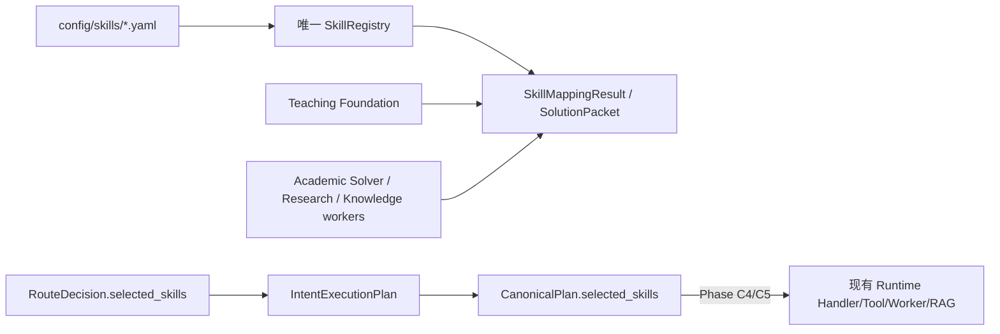

# Phase C1 Existing Skill Audit and Contract

## 结论

仓库已经存在且实际被多个业务链路使用的唯一 `SkillRegistry`：
`apps/api/app/services/skill_registry.py`。其 YAML 来源是
`config/skills/{CT,AE,DE}.yaml`，目前共有 30 个稳定 ID。C1 不创建第二个
注册表、不创建 public Agent、不把 Skill 变成 Runtime 生命周期对象。



## 现状审计

| 对象 | 当前事实 | 分类 | C1 判断 |
|---|---|---|---|
| `SkillRegistry` | 加载 CT/AE/DE YAML；校验课程、能力、先修 DAG；提供 `get`、按课程列表和确定性 `map_skills` | KEEP / EXTEND | 唯一 identity owner；C2 只在此扩展版本、状态、过滤和校验 |
| `config/skills/*.yaml` | 结构稳定，使用 `skill_id/title/course_id/chapter/prerequisites/problem_types/capability_ids` | KEEP / EXTEND | 保持现有字段；新增字段必须有默认值，旧 YAML 不迁移即能加载 |
| `RouteDecision.selected_skills` | 路由结果中的兼容字段，来源可来自 Intent Recognition | ADAPT | 保留 API/事件兼容；Phase C4 由 Planner/SkillPolicy 产出的 canonical selection 覆盖或为空，不再单独形成第二次路由 |
| `IntentExecutionPlan.selected_skills` | 已被 plan compiler 和 task event 使用 | KEEP / ADAPT | 作为旧执行计划的兼容投影；不新增平行计划结构 |
| `CanonicalPlan.selected_skills` | Phase B 已有字段，当前主要承载旧 plan 的 skill IDs | KEEP / EXTEND | 作为 Phase C 的唯一计划选择边界，后续附带版本和 rejection/trace 元数据 |
| `TeachingFoundationService` | 将 SolverResult 适配为 SolutionPacket，并通过 SkillRegistry 做 skill mapping；用于 evidence/hint/learning | KEEP / ADAPT | 继续消费注册 ID；不让教学层创建或执行 Skill |
| `SolutionPacketAdapterService` | 依据 problem type/capability/terms 调用 Registry 的确定性映射 | KEEP / ADAPT | 作为现有兼容映射；C3 以新 SkillRetriever/Policy 约束 Planner，不复制本适配器 |
| `AcademicProblemSolverService` / CT graph | 真实求解 worker/graph，已有可验证电路能力 | KEEP / ADAPT | 保持为执行能力 owner；Skill 只绑定它已有的 operation/handler |
| Research workers | `AcademicSearchPlannerService`、paper review、frontier、analysis runtime 等内部 worker | ADAPT | 以 eligible worker metadata 被检索；不拆成 public Agent，不复制执行生命周期 |
| Knowledge workers | `KnowledgeQAService`、retrieval/index/grounding 相关服务 | ADAPT | 以 query rewrite/grounded explanation 等 skill metadata 暴露已有能力 |
| `AgentRegistry` / Runtime handler registry | Agent 生命周期、Agent 可用性、handler/tool 执行注册 | KEEP / FREEZE | 不并入 SkillRegistry；Skill 不能拥有 Agent ID、checkpoint 或独立 Runtime |
| 旧的关键词/问题类型映射 | 分散在 Intent Recognition、SolutionPacketAdapter、课程 YAML | ADAPT / REMOVE LATER | 先通过兼容适配收敛入口；在 C4/C7 有 parity 后再移除重复 authority |
| SkillMemory / Reflection | 当前不存在 Phase C 所需的 experience memory/critic loop | FREEZE | C 阶段明确不新增，避免能力边界扩张 |

## Phase C SkillDefinition contract

现有 `SkillDefinition` 已向后兼容地增加以下表达能力；老 YAML 的默认值由模型填充：

- identity: `skill_id`、`version`、`status`；状态为 `active`、`experimental`、`frozen` 或 `deprecated`；
- naming/domain: `title`（旧字段）、`name`、`description`、`domain`、`course_id`；
- matching: `capability_ids`、`problem_types`、`prerequisites`、`keywords`、`semantic_description`；
- execution binding metadata: `input_contract`、`output_contract`、`eligible_workers`、`eligible_tools`；
- safety/evidence: `required_evidence`、`risk`、`budget_hint`、`verification_requirements`；
- `SkillMatch` 明确表达 `score`、`match_reasons`、`eligibility`、
  `prerequisite_status`、`policy_status` 和 `version`，不包含 handler、Agent 或执行状态。

该 contract 只描述元数据和检索/策略结果。C1 不实现 semantic vector retrieval、不接入真实 Planner 路径、不执行 Skill、不实现 SkillMemory。

## Owner boundary

```text
SkillRegistry      = identity / metadata / version / prerequisite validation
SkillRetriever     = bounded candidate retrieval (C3)
SkillPolicy        = allow/deny/fail-closed decision (C3)
PlannerService     = goal decomposition and canonical plan (C4)
Runtime handler    = existing worker/tool/RAG/capability execution (C5)
Teaching/learning  = consume skill IDs and evidence, not create skill identity
```

## C1 verification

```powershell
.\.venv\Scripts\python.exe -m pytest -q --no-cov apps/api/tests/test_skill_contract_phase_c.py apps/api/tests/test_skill_registry.py
```

The contract test verifies that all existing CT/AE/DE YAML remains loadable and
that `SkillMatch` is a non-executable metadata object.
