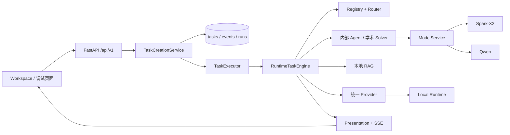
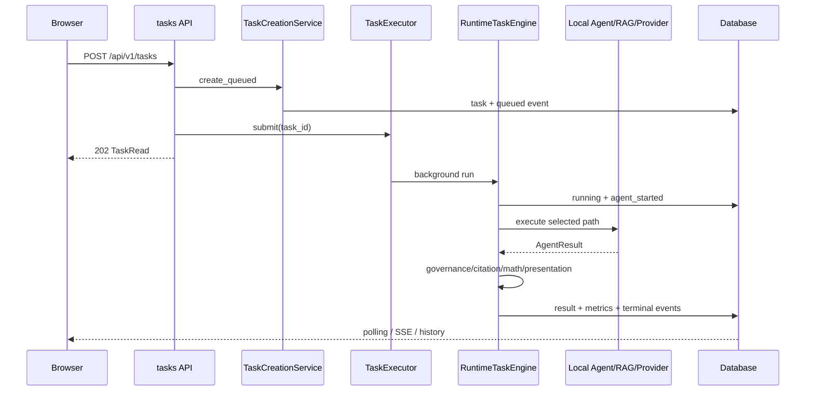
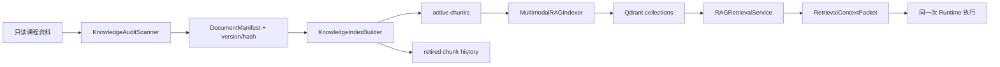

# 芯智导学代码级开发手册

> 快照日期：2026-08-23
> 适用仓库：`xinzhi-daoxue` 当前 FastAPI 多智能体平台
> 目标读者：需要在现有架构上继续微调、排错、增加课程或 Agent 的开发者

本文不是产品介绍，而是面向 coding 的代码导航。它解释当前代码从哪里进入、对象如何装配、一次请求如何流动、每个目录应该放什么，以及修改常见功能时应同时检查哪些文件。

配套文档：

- [仓库完整架构梳理](repository_architecture_guide.md)：架构、功能和数据边界总览。
- [仓库逐文件目录](repository_file_catalog.md)：Git 可见文件的逐文件索引，由脚本自动生成。
- [本地开发指南](deployment/local_development.md)：启动、环境和常用命令。
- [测试指南](testing_guide.md)：测试分层和验收命令。
- [统一学术求解器](universal_academic_solver.md)：多学科 Solver 设计。
- [学习与质量闭环](implementation/learning_quality_loop.md)：学习动作、质量门和数据库设计。
- [教学闭环第二阶段](architecture/teaching_loop_phase2.md)：有限核对、分级提示、披露与状态恢复。

快速跳转：

- 基础结构：[目录地图](#3-仓库目录地图)、[应用装配](#4-应用创建与依赖装配)、[合同与数据库](#5-合同数据库模型与序列化边界)
- 核心执行：[任务调用链](#6-任务从提交到显示的完整调用链)、[Agent 与路由](#7-agent-注册路由和-supervisor)
- 控制面收口：[Phase N 控制面](#6a-phase-n-v2-控制面)
- 能力模块：[专业求解](#8-多学科专业求解链)、[知识与 RAG](#9-本地知识库与-rag)、[模型与 Provider](#10-模型内部-agent-与本地-provider)、[学习闭环](#11-学习闭环)
- 开发工具：[API](#12-api-地图)、[前端](#13-静态前端)、[评测](#15-评测框架)、[测试](#17-测试地图)、[常见微调入口](#19-常见微调任务从哪里开始)、[排错](#21-常见排错路径)

## 1. 阅读顺序与事实来源

建议按以下顺序认识仓库：

1. `README.md`：知道平台现在能做什么、如何启动。
2. `apps/api/app/main.py`：看清所有运行时对象如何创建并放入 `app.state`。
3. `apps/api/app/api/v1/router.py`：看清全部 API 模块如何挂载。
4. `task_creation_service.py`、`application/tasks/coordinator.py`、`services/runtime_task_engine.py`：理解任务创建、调度与 Runtime 执行链。
5. `agent_configs/registry.yaml`、`agents/registry.py`、`agents/router.py`：理解 Agent 定义与自动路由。
6. `contracts/`、`models/entities.py`：理解 API、领域合同和持久化结构。
7. 再按需求进入 Solver、RAG、Provider、学习闭环或前端。

发生冲突时，事实优先级为：

1. 当前代码和 Alembic migration；
2. `agent_configs/`、`config/`、`knowledge_config/` 中的运行配置；
3. 自动导出的 `docs/api/openapi.json`；
4. 本文和其他架构文档；
5. `docs/reviews/` 中带日期的历史报告。

`docs/reviews/` 记录当时的验证结果，不应当被理解为当前版本仍然具有同样指标。`archive_legacy/` 只用于历史审计，不是新功能开发目录。

## 2. 当前系统的最小心智模型



必须记住的架构约束：

- 正式任务入口仍是 `POST /api/v1/tasks`，`POST /api/v1/chat` 只是适配到同一任务链。
- API 创建任务后立即返回，Provider 不在创建请求线程里执行。
- 当前 `LocalTaskExecutor` 包装 `TaskExecutionCoordinator`；`QueueTaskExecutor` 只负责发布任务，Worker 端复用同一 coordinator 与 lease manager。
- 学生端只提交自然语言和附件，Agent 选择属于自动路由；手动 Agent 选择只用于调试。
- 本地 RAG 是证据、上下文和解释性层，不是另一套问答系统。
- `SOLVER_CT_V1` 是冻结的历史基线与只读审计资产，不参与当前 Runtime 路由。
- 业务任务统一走本地 Runtime；历史 `allow_cloud` 字段在入口被丢弃，不能启用远程路径。

### 6a. Phase N v2 控制面

新任务的唯一生产控制链是：

```text
Unified ingress
  → GoalContract
  → deterministic preflight
  → PlannerService
  → CapabilityBindingRegistry + SkillRegistry/Policy
  → CanonicalPlan
  → RuntimeTaskEngine / PlanExecutor
  → verification / governance / result commit
```

`TaskRouter` 是预检和兼容映射，不是 active 最终 route owner；`OverallRoutingService` 和
`FallbackRoutingService` 在 active 模式不注入 Runtime preparation；`IntentPlanCompiler`
只作为 shadow/旧 checkpoint adapter。active 任务没有有效 CanonicalPlan 时失败关闭。
完整矩阵见 [Phase N closeout](architecture/phase_n_control_plane_closeout.md)。

## 3. 仓库目录地图

| 路径 | 当前职责 | 修改时注意 |
|---|---|---|
| `apps/api/app/` | FastAPI 应用和全部运行时代码 | 新业务代码的主要位置。 |
| `apps/api/alembic/` | 数据库增量迁移 | 只新增 migration，不修改已提交 migration。 |
| `apps/api/tests/` | API、服务、路由、RAG、Provider、页面测试 | 修改对应模块时先找同名前缀测试。 |
| `agent_configs/` | Agent 注册、路由、输入输出映射、旧工作流配置 | 新增 Agent 优先配置驱动，不在 Router 里硬编码 ID。 |
| `config/` | 模型、模型路由、学习掌握度配置 | 模型别名与业务 task type 在这里映射。 |
| `knowledge_config/` | 课程元数据、同义词和人工批准纠错 | 不直接改原始教材来修检索元数据。 |
| `evaluation/` | 评测案例、schema、rubric、manifest 和报告目录 | 合成样例必须标注 synthetic；私有题放 ignored 目录。 |
| `scripts/` | 启动、索引、评测、校验、导出和维护脚本 | 命令应兼容 PowerShell，并尽量保留 Linux/macOS 入口。 |
| `docs/` | 架构、开发、部署、评测和历史报告 | `repository_file_catalog.md` 由脚本维护。 |
| `local_knowledge/`、课程中文目录 | 本机课程资料入口 | 原始资料只读、Git 忽略，不搬迁、不公开。 |
| `knowledge_indexes/` | 本地索引和 Qdrant 数据 | 运行产物，不能作为源代码提交。 |
| `local_storage/` | 上传、缓存和本地对象存储回退 | 包含运行数据，不是测试 fixture。 |
| `archive_legacy/` | 退出活动架构的历史材料 | 不导入、不注册、不开发新功能。 |

根目录关键文件：

| 文件 | 用途 |
|---|---|
| `README.md` | 项目入口、能力边界和快速启动。 |
| `.env.example` | 可提交的空值配置模板；真实密钥只进入 `.env`。 |
| `docker-compose.yml` | PostgreSQL、Redis、MinIO、Qdrant 和 API 容器。 |
| `xzd.cmd` / `xzd.ps1` / `xzd.sh` | 统一命令包装。 |
| `打开芯智导学.cmd` | Windows 双击启动并打开 `/workspace`。 |
| `AGENTS.md` | 当前仓库工程规则。 |

## 4. 应用创建与依赖装配

### 4.1 唯一组合根

`apps/api/app/main.py:create_app()` 是运行时组合根。它按以下顺序创建对象：

1. `Settings`、数据库 engine 和 session factory；
2. `AgentRegistry`、顶层 Provider 和 `TaskRouter`；
3. Spark/Qwen Provider、`ModelRegistry`、`ModelService`；
4. Course、Capability、Tool registry 和 `GraphFactory`；
5. `AcademicProblemSolverService`、内部 Agent Hub 与一般问题服务；
6. `KnowledgeBaseService`、Embedding、Reranker、VectorStore 和 `RAGRetrievalService`；
7. 检索上下文、知识问答、Supervisor；
8. `TeachingExecutionPlanner`、有限核对/提示/披露服务、`RuntimeTaskEngine`、`LearningLoopService`、`LocalTaskExecutor` 和 RAG Debug；
9. 在 lifespan 中把对象写入 `app.state`。

不要在各 API 模块里重新创建上述重对象。API 通过 `request.app.state` 或 `dependencies.py` 获取共享实例。

### 4.2 Lifespan 边界

启动阶段：

- 保存共享服务到 `app.state`；
- 测试环境使用 `Base.metadata.create_all` 创建隔离表；
- 正常开发/生产依赖 Alembic migration，不使用 `create_all` 代替迁移。

关闭阶段：

- `TaskExecutor.shutdown()` 取消未完成的本地任务；
- 关闭 Agent Provider、ModelService 与数据库 engine；
- RAG retrieval 在 RuntimeTaskEngine 关闭时释放向量资源。

### 4.3 请求级依赖

`apps/api/app/dependencies.py` 提供：

- `get_settings_from_app()`；
- `get_provider()`；
- `get_knowledge_base()`；
- `get_rag_retrieval()`；
- `get_db()`，每次请求创建异步数据库 session。

新增 API 时优先复用这些依赖；只有专用共享服务才直接从 `request.app.state` 读取。

## 5. 合同、数据库模型与序列化边界

### 5.1 三类数据对象不要混用

| 类型 | 目录 | 作用 |
|---|---|---|
| Pydantic 合同 | `contracts/` | API 输入输出、领域状态、Provider 结果、运行时展示。 |
| SQLAlchemy 模型 | `models/entities.py` | 数据库存储结构和关系。 |
| 配置 dataclass/Pydantic | `agents/registry.py`、`services/model_registry.py` 等 | YAML 解析后的不可变运行配置。 |

Pydantic 合同可以扩展兼容字段，但删除或重命名公开字段前必须检查 OpenAPI、静态前端和历史任务读取。数据库模型变化必须增加 migration。

### 5.2 合同模块

| 文件 | 核心对象 | 用途 |
|---|---|---|
| `contracts/agent.py` | `AgentRequest`、`AgentResult`、`AgentEvent`、`RunMetrics` | 现有任务和 Provider 的基础协议。 |
| `contracts/api.py` | `TaskRead`、`SessionRead`、`EventRead` | REST 输出。 |
| `contracts/orchestration.py` | `AgentRequestV2`、`AgentResponse`、`TaskFamily`、`CourseCode` | 新编排层与 `/chat` 适配。 |
| `contracts/routing.py` | `RouteDecision`、`RouteCandidate` | 路由选择、置信度和来源。 |
| `contracts/runtime.py` | `WorkflowContextBundle`、`TaskPresentation`、`TaskExecutionSummary` | 统一 RAG 上下文与学生端展示。 |
| `contracts/knowledge.py` | `DocumentManifest`、`KnowledgeChunk`、`RetrievalResult`、`CitationSupport` | 知识版本、检索和引用。 |
| `contracts/solver.py` | `AcademicProblem`、`SolverResult`、质量门与验证结构 | 多学科专业求解。 |
| `contracts/learning.py` | 学习状态、答案检查、变式和学习动作 | 学习闭环 API。 |
| `contracts/model.py` | `ModelResponse`、`ModelUsage`、`ImageInput` | 国产模型统一接口。 |
| `contracts/math_content.py` | 公式表达式和富文本片段 | 后端公式规范化与前端 KaTeX。 |

### 5.3 数据表

`models/entities.py` 当前包含：

| 表/模型 | 主要内容 |
|---|---|
| `sessions` / `SessionModel` | 用户、课程、会话元数据。 |
| `tasks` / `TaskModel` | 输入、路由、状态、结果、幂等、重试、租约、心跳和失败分类。 |
| `files` / `FileModel` | 上传元数据和存储定位。 |
| `artifacts` / `ArtifactModel` | 解释、报告等任务产物。 |
| `agent_runs` / `AgentRunModel` | Provider、耗时、状态、trace 和指标。 |
| `task_events` / `TaskEventModel` | 递增 sequence 的任务/SSE 事件。 |
| `learner_knowledge_states` | 用户在课程知识点上的掌握度。 |
| `wrong_answer_records` | 错题、错误类型、反馈和掌握度变化。 |
| `practice_attempts` | 变式题、参考答案、学生答案和检查结果。 |
| `learning_interactions` | 学习按钮动作及其幂等结果。 |

迁移链：

```text
20260716_0001_initial_schema
  -> 20260717_0002_task_lifecycle
  -> 20260717_0003_task_routing
  -> 20260718_0004_student_context
  -> 20260722_0005_learning_reliability
```

## 6. 任务从提交到显示的完整调用链



### 6.1 创建阶段

`TaskCreationService.create_queued()` 负责：

- 校验 session、用户、附件和 Agent 请求；
- 执行路由并把路由上下文写入输入；
- 使用 `(user_id, idempotency_key)` 返回已有任务，防止重复提交；
- 持久化 queued 状态和初始事件；
- 不直接执行 Provider。

API 层随后调用 `app.state.task_executor.submit(task_id)`。Local executor 转发给 `TaskExecutionCoordinator`；Redis 模式由 Worker 使用同一 coordinator 与租约协议。

### 6.2 执行阶段

`RuntimeTaskEngine.execute()` 只编排以下独立阶段：

1. 锁定 queued 任务，检查取消状态；
2. 写入 running、owner、lease、heartbeat 与启动事件；
3. 读取持久化 `AgentRequest` 和 `RouteDecision`；
4. `AgentExecutionPlanner` 生成执行计划；
5. 根据 Agent mode 选择 routing-only、retrieval-only、内部 Agent 或 Provider；
6. 如需 RAG，只检索一次并构造共享 `WorkflowContextBundle`；
7. 本地内部能力优先，云端调用必须通过授权检查；
8. 执行受控 fallback、结果治理、Solver quality gate 和引用校验；
9. 规范化数学内容，构建 `TaskPresentation` 和 `TaskExecutionSummary`；
10. 保存任务结果、AgentRun、RunMetrics 和终态事件。

如果要修改执行顺序，必须同时检查：取消、SSE 顺序、重试分类、引用、presentation 和对应测试。不要绕过 RuntimeTaskEngine 或增加平行执行器。

### 6.3 查询、取消和重试

- `TaskQueryService`：查询任务、事件和会话历史。
- `TaskControlService.cancel()`：记录取消请求，Provider 支持取消时再转发。
- `TaskControlService.retry()`：只允许配置的失败分类和未超过 `max_attempts` 的任务重试。
- `event_service.append_task_event()`：统一生成事件 sequence。

## 7. Agent 注册、路由和 Supervisor

### 7.1 AgentRegistry

`agent_configs/registry.yaml` 是顶层 Agent 和路由规则的主要事实来源。`AgentRegistry` 会：

- 拒绝 YAML 重复 key；
- 解析 provider、mode、capability、input/output mapping、retrieval policy 和 fallback；
- 校验 Agent 定义和 fallback 引用；
- 根据 Settings 解析本地 Provider 与 Runtime 可用性。

当前主要 Agent：

| Agent | 用途 | 默认路径 |
|---|---|---|
| `ACADEMIC_PROBLEM_SOLVER` | CT/AE/DE/SS 专业问题求解 | 本地多学科 Solver。 |
| `SOLVER_CT_V1` | CT 冻结历史基线 | 只读审计，不参与当前路由。 |
| `LEARN_01_KNOWLEDGE_QA_V1` | 课程知识问答 | 本地 RAG 与 Local Runtime。 |
| `LEARN_01_LOCAL_RETRIEVAL_V1` | 纯本地检索降级 | 不调用云端。 |
| `GENERAL_QUESTION_V1` | 随机/通用问题 | 无课程线索的明确常识问句直接使用 Spark；低置信文本也可进入该本地模块。 |
| `TEACH_01_LESSON_PREP_V1` | 教案设计 | 内部 Agent，可使用同任务 RAG。 |
| `TEACH_02_ASSIGNMENT_REVIEW_V1` | 作业初审 | 内部 Agent。 |
| `RESEARCH_02_ACADEMIC_WRITING_V1` | 学术写作辅助 | 内部 Agent。 |
| `RESEARCH_03_DATA_ANALYSIS_V1` | 数据分析解释 | 内部 Agent。 |
| `ROUTER_01_FALLBACK_V1` | 低置信本地调度候选 | 只选择已注册的本地路径。 |

### 7.2 TaskRouter

`TaskRouter.route()` 执行本地确定性路由：

- 从文本、课程提示和附件识别 course、intent、input type、task subtype；
- 对 registry routing rule 评分；
- 检查目标 Agent 输入支持、配置和运行可用性；
- 生成包含候选、理由、来源和置信度的 `RouteDecision`；
- 低置信时只能进入一次受控 fallback，不能默认落入 CT Solver。

修改关键词和分流规则时，优先改配置或局部检测函数，并同步维护 `test_automatic_routing_fixture.py` 的路由样例。

### 7.3 XZDSupervisor

`XZDSupervisor.prepare()` 面向 `/chat` 新协议，负责课程、意图、任务族、输入类型和安全本地 fallback，然后转换成现有 `AgentRequest`。它不会建立第二套任务执行链。

Supervisor trace 存入 `TraceStore`，开发环境可通过 `/api/v1/debug/traces/{trace_id}` 查看脱敏摘要。

## 8. 多学科专业求解链

### 8.1 模块分工

| 模块 | 职责 |
|---|---|
| `services/academic_solver_service.py` | 处理附件/图像、多图逐图汇总、模型生成、续写、截断修复和二次审查。 |
| `multimodal/image_composer.py` | 规范化多图；简单批次有序拼接，超限或拼接失败时返回逐图策略。 |
| `orchestrator/graphs/academic_solver_graph.py` | CoursePack、CapabilityPack、工具选择和 HIGH_RISK 图流程。 |
| `courses/registry.py` | CT/AE/DE/SS 课程包、能力和验证规则。 |
| `capabilities/registry.py` | 可复用的专业能力定义。 |
| `tools/` | calculator、SymPy 方程求解和单位兼容检查。 |
| `services/high_risk_verification.py` | 单位、数量级、方向、边界和二次审查合并。 |
| `services/solver_quality_gate.py` | 将课程 verification rules 转成统一 quality gate。 |
| `contracts/solver.py` | `SolverResult`、structured final answer、verification、evidence 和 gate 结果。 |

### 8.2 执行路径

Graph 根据问题风险、课程包状态和输入完整性选择 FAST、STANDARD、HIGH_RISK 或 insufficient 路径。HIGH_RISK 需要验证报告；`RuntimeResultPipeline` 还会根据 Agent 声明的 `ACADEMIC_SOLVING` task family 应用统一质量门，而不是硬编码具体 Solver ID。

`AcademicProblemSolverService` 对长答案支持有限次数续写。判断截断时会检查模型 finish reason、最大 token、公式/代码围栏和结构完整性；续写次数与 token 上限来自 Settings。

多图输入先由 `MultiImageComposer` 规范化。简单批次拼接为带 `Image N` 标签的单图，只进行一次视觉提取；超过图片数、总像素、画布、长宽比或压缩限制时，按原顺序逐图识别，再通过 `multi_image_summary` 合并题设事实。汇总模型只允许整理条件、目标和跨图冲突，不负责求解；最终仍进入同一个学术 Solver。

### 8.3 扩展新课程

增加课程的一般步骤：

1. 在 `CourseCode` 和课程 registry 中声明课程；
2. 定义 CoursePack 的 problem types、capabilities、tools、fallback 和 verification rules；
3. 确认 Agent registry 的 `course_ids` 和 routing rules；
4. 增加课程级 Solver、路由、质量门和边界评测；
5. 如果有知识库，再添加 `knowledge_config/courses`、同义词和索引配置；
6. 不让新课程错误回退到 `SOLVER_CT_V1`。

## 9. 本地知识库与 RAG

### 9.1 两层检索

仓库同时保留：

- `KnowledgeBaseService`：轻量 Markdown/BM25/规则检索和无模型基础能力；
- `RAGRetrievalService`：dense、sparse、image、RRF、条件 reranker 和缓存的正式检索。

二者不是两套业务路由。正式任务由执行计划决定是否使用 RAG；不可用时可以明确降级到基础检索。

### 9.2 知识生命周期



关键模块：

| 模块 | 职责 |
|---|---|
| `knowledge_audit.py` | 扫描、hash、文档版本、图片关系、重复与质量问题。 |
| `knowledge_index.py` | Markdown 语义切块、chunk provenance、active/history 输出。 |
| `rag_index.py` | 文本/图片 embedding 和 Qdrant 写入；失败时保留旧集合。 |
| `rag_retrieval.py` | 多通道候选、RRF、rerank、去重、缓存和置信度。 |
| `retrieval_context.py` | 证据充分性判断和上下文长度控制。 |
| `citation_validator.py` | 校验 citation 对 active manifest/chunk 的支持关系。 |
| `knowledge_qa_service.py` | 检索、上下文和回答生成的业务组合。 |
| `rag_runtime.py` | 根据 Settings 创建 embedding/reranker/vector store。 |

### 9.3 修改检索时的检查点

- 新 metadata 必须来自真实扫描、切块或执行链，不能由前端伪造。
- chunk ID 必须包含文档版本，旧版本不得继续作为 active 证据。
- 不要在 embedding 成功前重建或清空生产 collection。
- Solver 使用的资料是 `method_reference` 时，不能伪装成答案事实引用。
- 检索参数改变后同时运行检索 benchmark、citation integrity 和跨课程污染测试。
- 原始教材目录只读；OCR/标题纠正通过 `knowledge_config/corrections` 并要求 approved 状态。

## 10. 模型、内部 Agent 与本地 Provider

### 10.1 ModelRegistry 与 ModelService

`config/models.yaml` 定义模型别名和 Provider；`config/model_routes.yaml` 把业务 task type 映射到 primary、fallback 和 verifier。

当前别名：

| 别名 | Provider/模型 | 主要用途 |
|---|---|---|
| `spark_reasoner` | 讯飞 Spark-X2 | 复杂文本推理、知识回答和日常通用问答首选。 |
| `qwen_vision_primary` | Qwen 3.7 Plus | 电路图和复杂多模态。 |
| `qwen_vision_fast` | Qwen 3.6 Flash | 快速图像理解。 |
| `qwen_text_fast` | Qwen 3.5 Flash | 分类、改写、轻量结构化；通用问答的可用性后备。 |

`ModelService` 统一处理：

- 文本、JSON、图像和 streaming；
- task type 路由和 fallback；
- 并发 semaphore、timeout、最多一次 retry；
- token usage、模型调用 trace 和二次验证。

新增模型时，先增加 ModelDefinition 和 Provider 实例，再在 model routes 中引用。业务服务不应直接拼供应商 URL。

### 10.2 内部 Agent

`agents/internal/hub.py` 注册 subordinate-only 的分类、查询改写、电路规划、视觉提取、备课、作业初审、学术写作和数据分析 Agent。`InternalAgentExecutionService` 把这些结构化结果转换成统一 `AgentResult`。

内部 Agent 可以复用 ModelService 和同一任务的 RAG context，但不能绕开顶层 Agent Registry 或创建新的学生端选择器。

### 10.3 Provider 边界

| 目录/文件 | 作用 |
|---|---|
| `providers/llm/` | Spark、DashScope 和 OpenAI-compatible 模型实现。 |
| `providers/embedding/` | BGE 和显式 legacy hash 兼容层。 |
| `providers/vision/` | 视觉 Provider 抽象。 |
| `providers/local.py` | 本地 Runtime Agent Provider。 |
| `providers/mock.py` | 基础测试 Mock。 |
| `providers/development_mock.py` | 可配置开发 Mock，输出必须标记。 |

业务代码不得绕过 Local Runtime 或 `ModelService` 直接拼接供应商 HTTP；Provider 返回只代表执行完成，结果仍需经过合同、证据和质量门校验。

## 11. 学习闭环

学生端六个动作由 `POST /api/v1/learning/actions` 统一接收：

| action | 服务行为 |
|---|---|
| 加入错题本 | 保存来源任务、答案、错误类型和掌握度变化。 |
| 提示 | 返回分层提示并记录 hint 行为。 |
| 检查 | 对步骤、数值、单位和方向进行规则检查。 |
| 变式 | 只对可确定验证的题型生成变式；否则返回 unsupported。 |
| 关联知识 | 返回来源任务已有知识证据，不重新伪造检索过程。 |
| 已掌握 | 按配置更新 mastery/confidence。 |

模块关系：

- `LearningLoopService`：动作编排、幂等和持久化；
- `StudentAnswerReviewService`：规则检查；
- `PracticeGenerationService`：确定性变式；
- `config/learning_mastery.yaml`：掌握度变化参数；
- `GET /api/v1/learning/states`：查询用户知识点状态。

扩展新变式题型时必须同时提供：输入识别、确定性参数变换、可计算参考答案、单位/容差和专项测试。不能只用模型生成题面而没有验证链。

## 12. API 地图

所有业务 API 统一挂载在 `/api/v1`。详细 schema 以 `docs/api/openapi.json` 为准。

| 前缀 | 主要模块 | 功能 |
|---|---|---|
| `/health` | `health.py` | 服务与依赖健康。 |
| `/sessions` | `sessions.py` | 创建、读取会话和历史任务。 |
| `/tasks` | `tasks.py` | 创建、查询、事件、SSE、取消和重试。 |
| `/files` | `files.py` | 上传与文件元数据。 |
| `/artifacts` | `artifacts.py` | 任务产物读取。 |
| `/knowledge` | `knowledge.py` | 资料状态、检索、RAG、文档/图片和 reload。 |
| `/learning` | `learning.py` | 学习动作和掌握状态。 |
| `/agents` | `agents.py` | 脱敏 Agent 状态、详情和 dry-run。 |
| `/internal-agents` | `internal_agents.py` | 内部 Agent 配置状态。 |
| `/models` | `models.py` | 模型注册与可选 live health。 |
| `/chat`、`/capabilities`、`/workflows` | `orchestration.py` | 新编排协议对现有任务链的适配。 |
| `/debug/rag` | `debug_rag.py` | 检索 run、compare、trace、eval 和预热。 |
| `/debug/agents` | `debug_agents.py` | Agent 合同、Mock、比较和 contract tests。 |
| `/debug/execution` | `debug_execution.py` | 单任务脱敏执行链和聚合指标。 |
| `/debug/traces` | `debug_traces.py` | Supervisor/model 脱敏 trace。 |
| `/evaluation` | `evaluation.py` | 评测套件和最新报告，只在配置允许时开放。 |

新增或修改端点后必须重新运行 `scripts/export_openapi.py` 和 `test_openapi_export.py`。

## 13. 静态前端

前端位于 `apps/api/app/static/debug/`，无 Node 构建步骤，由 FastAPI 直接提供静态资源。

| 页面 URL | HTML/JS | 用途 |
|---|---|---|
| `/` | `home.html` | 能力入口导航。 |
| `/workspace`、`/student` | `workspace.html` + `workspace.js` | 正式学生工作台、历史、SSE、证据和学习动作。 |
| `/debug`、`/demo` | `demo.html` + `demo.js` | 演示与调试任务。 |
| `/debug/agents` | `agents.html` + `agents.js` | Agent 注册和合同调试。 |
| `/debug/rag`、`/debug/execution` | `execution.html` + `execution.js` | RAG/任务瀑布和聚合指标。 |
| `/system` | `system.html` + `system.js` | 系统健康与能力状态。 |

共享资源：

- `ui-core.js`：请求、状态、导航、主题和本地 KaTeX 接口；
- `design-tokens.css`：颜色、字体、间距等 token；
- `components.css`、`pages.css`：共享组件和页面布局；
- `workspace-v2.css`、`execution-v2.css`：复杂页面专用布局；
- `vendor/katex/`：完全本地的公式渲染库和字体。

修改 Workspace 时重点检查：

- 会话恢复与 `GET /sessions/{id}/tasks`；
- 长回答滚动和历史记录；
- SSE 断线重连和终态轮询；
- `presentation` 优先、旧 `answer` 兼容；
- 公式在代码块、URL、日期和 JSON 中不能误转；
- 多图选择最多 8 张，只允许图片批次；上传顺序必须与任务附件顺序一致；
- 不展示 Provider、内部 Agent ID、原始 prompt 或 Point ID；
- Mock、fallback、证据不足和不支持状态必须明确显示。

教学基础能力仍走同一个 `/tasks` 链路。输入规范化在
`services/teaching_input.py`，结果适配入口在
`services/teaching_foundation.py`；SolutionPacket、EvidencePacket、技能配置和
短期状态的详细边界分别见 `docs/implementation/solution_packet_v1.md`、
`evidence_packet_v1.md`、`skill_registry.md` 和 `teaching_state_boundaries.md`。
Workspace 第一阶段只展示 `direct_answer`、`check_my_work`，不得把预留的
`guided_learning`/`review` 宣称为完整功能。

## 14. 可观测性和调试

当前可观测数据分为三层：

1. `RunMetrics`：任务级耗时、模型调用、token、fallback、检索和引用指标；
2. `AgentRunModel.metrics_data`：持久化执行指标和 `trace_id`；
3. `TraceStore` / `ModelTracer`：开发态脱敏节点和模型调用记录。

`GET /api/v1/debug/execution/metrics/summary` 聚合成功率、延迟分布、慢任务、Provider 调用、token、fallback 和 retrieval success。单任务详情使用 `/api/v1/debug/execution/{task_id}`。

新增 trace 字段时必须先经过 redaction。禁止记录 API key、secret、完整上传内容、学生隐私、原始教材全文或完整模型 prompt。

## 15. 评测框架

### 15.1 目录职责

| 路径 | 内容 |
|---|---|
| `app/evaluation/contracts.py` | case、provenance、rubric、result 和 report 合同。 |
| `app/evaluation/loader.py` | YAML/JSON 加载和筛选。 |
| `app/evaluation/runner.py` | 通过真实应用 lifespan 和 HTTP 任务链运行案例。 |
| `app/evaluation/scorers/core.py` | 路由、课程、Agent、结构、答案、引用、安全和教学基础合同评分。 |
| `app/evaluation/reporting.py` | JSON/Markdown 报告和统计。 |
| `evaluation/schemas/` | case/rubric JSON Schema。 |
| `evaluation/rubrics/` | 默认评分维度。 |
| `evaluation/manifests/` | 数据集来源和发布边界。 |
| `evaluation/private_cases/` | Git 忽略的真实私有题。 |
| `evaluation/reports/`、`cache/` | Git 忽略的运行产物。 |
| `evaluation/cases/teaching_foundation/` | 非正式 synthetic 教学合同案例，不代表教学效果。 |

### 15.2 运行模式

| mode | 含义 |
|---|---|
| `local_deterministic` | 本地确定性执行，不调用付费模型。 |
| `local_mock` | 明确 Mock 的协议/页面验证。 |
| `real_model` | 真实国产模型调用，必须 `--confirm-paid`。 |

`scripts/run_evaluation.py` 使用按最新 migration revision 命名的隔离 SQLite 缓存库，避免复用旧 schema。默认公开样例仅用于框架回归，不代表真实学科准确率。

常用命令：

```powershell
.\.venv\Scripts\python.exe scripts\validate_evaluation_cases.py
.\.venv\Scripts\python.exe scripts\run_evaluation.py --validate-only
.\.venv\Scripts\python.exe scripts\run_evaluation.py --mode local_deterministic --suite task_reliability --no-cache
.\.venv\Scripts\python.exe scripts\compare_evaluation_reports.py <baseline.json> <candidate.json>
```

## 16. 脚本与日常命令

### 16.1 统一启动器

`scripts/team_launcher.py` 支持：

- `start`：准备 venv/.env、启动依赖、迁移并启动 API；
- `stop`：停止依赖容器，不删除卷；
- `status`：查看容器和 API；
- `doctor`：检查 Python、Docker、配置和路径；
- `preflight`：不付费的演示检查，`--with-cloud` 才调用云端；
- `index`：按课程建立本地索引。

Windows 推荐：

```powershell
.\xzd.cmd doctor
.\xzd.cmd start --reload
```

### 16.2 校验脚本

| 脚本 | 用途 |
|---|---|
| `scripts/check.ps1` / `check.sh` | 总校验入口。 |
| `validate_config.py` | 配置结构与安全边界。 |
| `check_sensitive_files.py` | 敏感文件和凭据扫描。 |
| `export_openapi.py` | 更新 OpenAPI 快照。 |
| `generate_repository_catalog.py` | 更新/检查逐文件目录。 |
| `smoke_test_models.py` | 模型配置或显式真实连通性。 |
| `knowledge_base_cli.py`、`rebuild_index.py` | 知识审计和索引构建。 |

## 17. 测试地图

测试主要位于 `apps/api/tests/`，文件名基本与业务模块对应：

| 改动类型 | 优先运行的测试 |
|---|---|
| Task/API/SSE | `test_task_api.py`、`test_background_runtime_execution.py`、`test_sse_*.py`、`test_event_sequence.py` |
| 路由/Agent | `test_task_router.py`、`test_automatic_routing_fixture.py`、`test_agent_registry.py` |
| Solver/质量门 | `test_universal_academic_solver.py`、`test_high_risk_verification.py`、`test_solver_quality_gate.py` |
| RAG/知识版本 | `test_knowledge_*.py`、`test_multimodal_rag.py`、`test_kb_citation_integrity.py` |
| 模型/Provider | `test_model_*.py`、`test_spark_llm_provider.py`、`test_provider_factory.py` |
| Workspace/页面 | `test_student_web.py`、`test_unified_web_ui.py`、浏览器 smoke 脚本 |
| 学习闭环 | `test_learning_loop.py` |
| 任务可靠性 | `test_task_executor_reliability.py`、`test_task_idempotency.py`、`test_task_retry.py` |
| 评测 | `test_evaluation_framework.py`、`test_real_evaluation_framework.py` |
| migration/OpenAPI | `test_migrations.py`、`test_openapi_export.py` |

本地提交前的推荐顺序：

```powershell
.\.venv\Scripts\python.exe -m ruff check apps/api/app apps/api/tests scripts tests
.\.venv\Scripts\python.exe -m mypy apps/api/app
.\.venv\Scripts\python.exe -m pytest apps/api/tests tests
.\.venv\Scripts\python.exe scripts\validate_config.py
.\.venv\Scripts\python.exe scripts\check_sensitive_files.py
.\.venv\Scripts\python.exe scripts\export_openapi.py
.\.venv\Scripts\python.exe scripts\generate_repository_catalog.py --check
docker compose config --quiet
git diff --check
```

真实模型和大型本地 embedding 测试需要单独授权、模型文件或 API key，不能把 skipped 描述成已通过真实验收。

## 18. 配置定位

### 18.1 Settings 分组

`core/config.py:Settings` 的环境变量大致分为：

- App/API/log；
- Database/Redis/storage；
- Spark/Qwen 模型与并发、timeout、token；
- 模型 Provider 授权、连接池和熔断；
- 上传、图像、PDF；
- 本地知识库路径和检索阈值；
- embedding、image embedding、reranker、Qdrant；
- RAG cache、worker、debug；
- 学生会话和性能预算。

配置值通过 Pydantic Settings 从环境变量读取。路径、模型名、并发、timeout 和阈值不得散落在业务代码里。

### 18.2 历史云端字段

业务请求中的 `options.allow_cloud` 仅为旧客户端兼容保留；合同校验阶段会删除该字段，不能改变本地 Provider、Runtime 或路由选择。需要真实模型时，只配置相应的 Model Provider 并按模型测试流程验收。

## 19. 常见微调任务从哪里开始

| 你想修改的内容 | 第一入口 | 通常还要同步检查 |
|---|---|---|
| 随机问题仍然要回答 | `general_question_service.py`、registry 的 fallback rule | Router fixture、Model route、前端 fallback 标签。 |
| 调整课程/意图识别 | `agents/router.py`、`agent_configs/registry.yaml` | Supervisor、70 路由 fixture、AE/DE 防误路由测试。 |
| 新增一个内部 Agent | `agents/internal/hub.py`、`contracts.py` | Model route、InternalAgentExecutionService、registry、评测。 |
| 新增顶层 Runtime 能力 | `agent_configs/registry.yaml` | 输入映射、结果 validator/renderer、Local Provider、路由测试。 |
| 调整专业答案格式 | `contracts/solver.py`、`academic_solver_service.py` | presentation、公式格式化、质量门、兼容字段。 |
| 提高长回答完整性 | `academic_solver_service.py` 的 continuation/truncation | token 配置、timeout、前端展示、专项测试。 |
| 调整多图处理 | `multimodal/image_composer.py`、`academic_solver_service.py` | Settings、模型路由、Workspace 多选、路由输入模式和批次测试。 |
| 修改 RAG 排序 | `rag_retrieval.py` | Settings、benchmark、citation、跨课程污染。 |
| 修改切块 | `knowledge_index.py` | chunker version、全量重建策略、旧 chunk history。 |
| 修改引用规则 | `citation_validator.py` | manifest/chunk provenance、TaskPresentation、UI 证据显示。 |
| 增加学习动作 | `contracts/learning.py`、`learning_loop.py` | API、migration、Workspace 按钮、幂等测试。 |
| 增加变式题型 | `practice_generation.py` | 答案检查、单位/容差、评测用例。 |
| 修改任务重试 | `task_control_service.py` | failure category、attempt、幂等、事件顺序。 |
| 替换本地执行为队列 | `task_executor.py` | app lifespan、worker lease/heartbeat、恢复和并发测试。 |
| 修改页面布局/交互 | 对应 HTML/JS/CSS | session 恢复、滚动、SSE、移动端、KaTeX。 |
| 增加 API 字段 | `contracts/api.py` + endpoint | OpenAPI、前端、向后兼容、序列化测试。 |
| 增加数据库字段 | `models/entities.py` + 新 migration | repository/service/API、SQLite/PostgreSQL migration test。 |

## 20. 安全修改模板

### 20.1 修改已有业务功能

1. 找到公开合同和对应测试；
2. 沿 API → service → repository/provider 的现有链修改；
3. 保持旧字段兼容，新增字段提供默认值；
4. 增加最小专项测试；
5. 运行专项测试，再运行 Ruff/Mypy/全量测试；
6. 如涉及 API、配置、目录，重新生成相应快照文档。

### 20.2 新增 Agent

1. 明确它是顶层工作流还是 subordinate internal Agent；
2. 先定义输入、输出、支持课程/意图和失败语义；
3. 复用 ModelService 或现有 Provider；
4. 在 registry/config 注册，不把 ID 分散硬编码；
5. 增加 availability、dry-run、Mock 标记和 fallback；
6. 增加路由、合同、结果质量和真实/Mock 边界测试。

### 20.3 修改数据库

1. 修改 ORM model；
2. 新建增量 migration；
3. 对已有行设置兼容 default/backfill；
4. 验证 SQLite 测试迁移和 PostgreSQL 语义；
5. 更新 API 合同、repository 和文档；
6. 不改旧 migration，不用 `create_all` 掩盖迁移缺失。

## 21. 常见排错路径

### 网站打不开

1. `\.\xzd.cmd status`；
2. `http://127.0.0.1:8000/health`；
3. 检查是否绕开统一启动器直接运行了读取 Docker 主机名的 Uvicorn；
4. 检查 8000 端口和重复 API 进程；
5. 检查 PostgreSQL/Redis/MinIO/Qdrant health，而不只看页面是否返回 200。

### 任务一直 running

1. 查询 `/tasks/{id}` 和 `/tasks/{id}/events`；
2. 查看 `execution_owner`、`heartbeat_at` 和 `lease_expires_at`；
3. 查看 `/debug/execution/{id}` 的 waterfall；
4. 判断卡在 retrieval、model/provider、citation 还是持久化；
5. 不直接把 running 改成 success。

### 回答降级或证据不足

1. 查看 RouteDecision 和执行计划；
2. 检查请求合同是否已剥离历史 `allow_cloud` 字段；
3. 查看 retrieval attempted、hits、evidence quality 和 citation status；
4. 检查本地模型 route 是否 configured；
5. 区分“路由成功”“Provider 返回”“答案质量通过”。

### 前端答案截断

1. 先查看任务 API 中保存的完整 `answer`/`presentation`；
2. 如果后端完整，检查 DOM、CSS overflow、历史容器和 KaTeX 异常；
3. 如果后端已截断，检查模型 finish reason、usage、continuation 和 timeout；
4. 不通过单纯提高前端字符上限掩盖后端截断。

## 22. 当前扩展边界和已知技术债

- `RuntimeTaskEngine.execute()` 只保留阶段编排；准备、执行、结果治理、提交、失败终态和后台副作用分别由独立服务负责。
- Queue executor 尚未实现，当前任务仅适合单 API 进程内执行。
- 学习答案检查和变式生成覆盖面有限，扩展必须保持确定性验证。
- 真实私有学科评测集尚未纳入仓库；公开 synthetic 样例不代表真实准确率。
- RAG embedding 维度变化需要受控重建，而不是在线覆盖旧集合。
- 静态前端没有组件构建系统，修改简单，但共享逻辑需要主动放入 `ui-core.js`，避免页面间复制。
- Debug 与学生页面共享部分静态基础设施，但学生页面必须继续隐藏内部字段。
- 真实 PostgreSQL 和真实国产模型仍需独立环境验收。

## 23. 文档维护

代码修改后按影响范围维护：

| 变更 | 必须更新 |
|---|---|
| 新增/删除/移动文件 | `python scripts/generate_repository_catalog.py` |
| API/合同变化 | `python scripts/export_openapi.py`、API 文档 |
| 数据库变化 | migration、本文数据表章节 |
| Agent/路由变化 | registry 文档、路由评测 |
| RAG/schema 变化 | knowledge 文档、索引版本和 benchmark |
| 启动方式变化 | README、团队快速启动、本地开发指南 |
| 评测模式变化 | evaluation guide、schema/rubric 文档 |

检查本手册中的路径是否仍存在，可以结合逐文件目录执行：

```powershell
.\.venv\Scripts\python.exe scripts\generate_repository_catalog.py --check
```

逐个文件的最新职责、大小和状态继续以 [仓库逐文件目录](repository_file_catalog.md) 为索引；本文负责解释文件之间的关系和安全修改路径。

## 教学闭环第三阶段导航

- 合同：`app/contracts/learning.py`、`app/contracts/conversation.py`
- ORM/migration：`app/models/entities.py`、
  `alembic/versions/20260726_0007_teaching_loop_phase3.py`
- Repository：`app/repositories/learning.py`
- Attempt/反馈：`student_attempts.py`、`feedback_uptake.py`
- 证据/状态：`learning_outcome.py`、`learning_loop.py`
- 延迟再测：`retest_plans.py`、`practice_generation.py`
- API：`app/api/v1/learning.py`
- Workspace：`workspace.html`、`workspace.js`、`workspace-v2.css`
- 配置：`config/learning_mastery.yaml`
- 案例：`evaluation/cases/teaching_loop_phase3/`
# Agent Runtime Foundation 导航

- 合同：`app/contracts/conversation.py`、`app/contracts/memory.py`
- ORM：`app/models/entities.py`
- 消息：`app/repositories/conversations.py`、
  `app/services/conversation_message_service.py`
- 上下文：`app/services/context_assembly.py`、`context_budget.py`、
  `context_cache.py`
- 状态与摘要：`session_working_state.py`、`session_compaction.py`
- 记忆：`app/repositories/memories.py`、`app/services/memory_service.py`
- API：`app/api/v1/sessions.py`、`app/api/v1/memories.py`
- 执行链接入：`task_creation_service.py`、`application/tasks/coordinator.py`、`runtime_task_engine.py`
- Workspace：`app/static/debug/workspace.html`、`workspace.js`、
  `workspace-v2.css`
- migration：`20260723_0006_agent_runtime_foundation.py`
- 专项测试：`tests/test_agent_runtime_foundation.py`
