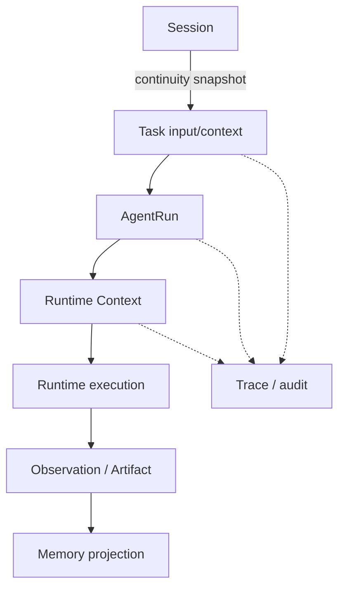

# Context 与 State 所有权

## 1. 结论

系统必须明确每类状态的唯一 owner。状态可以被其他层读取，但不能由多个层同时写成“事实来源”。

## 2. 所有权矩阵

| 状态 | 唯一 owner | 负责内容 | 可写时机 | 不应负责 |
| --- | --- | --- | --- | --- |
| Task State | Task/Task Control | created、queued、running、completed、failed、cancelled、retry lineage | Task API、Task Runtime 生命周期 | 用户长期偏好、节点临时变量 |
| AgentRun State | `AgentRun` / Runtime Controller | 一次 run 的 iteration、node status、budget、checkpoint、decision | Runtime 执行和恢复 | 改写 Task 的业务语义 |
| Runtime Context | Runtime preparation/execution boundary | 当前 run 可用的 request/context/evidence/handler inputs | 运行前构造，节点间按契约传递 | Session 长期历史、路由 owner |
| Session Context | `SessionModel.context_data` / SessionContextService | 当前会话连续性、active course、previous task、summary、approved evidence pointers | 会话任务提交/结果提交 | 运行中的 node state、长期跨会话经验 |
| Memory | Memory service/learning state | 长期可检索信息、学习状态、经验索引 | 经过 policy 和评估的写入 | 未验证的 route/plan、当前任务生命周期 |
| Trace/Audit | Trace/Event services | 不可变事件、route/plan/context identity、审计 | 每个边界变化时追加 | 作为业务状态的第二事实源 |

## 3. 当前边界与问题

- Supervisor 的 graph state、Task input 的 `_routing` 和 Runtime 的 `RouteDecision` 都可能记录 route facts；必须区分“trace snapshot”和“当前执行事实”。
- Session context 会被投影到 request options，但不能覆盖 checkpointed Runtime request/plan。
- `RuntimeRequestPreparationService` 会在非 resume 场景组装 context，并在 route refinement 后重组；这应产生 route/context revision，而不是静默覆盖。
- `AgentRun` 的 checkpoint 是一次执行的恢复事实；resume 不应读取新的 session summary 或重新调用 Overall Router。
- Memory 只提供候选信息，不能直接授权 Agent、Tool、Provider 或默认 Runtime 路径。

## 4. 读写规则

### Task

- 写入任务生命周期、入参快照、route/plan 引用和 retry parent/attempt。
- 接受 Runtime 的 terminal outcome，但不让业务 Worker 直接写状态。

### AgentRun

- 写入 node status、budget consumption、decision、checkpoint 和 recovery identity。
- 只通过 Task Completion/Result Pipeline 提交最终结果。

### Runtime Context

- 由 preparation boundary 构造并绑定 task/run/route revision。
- 只携带当前执行所需的最小 context；不得把完整 Session/Memory 无界复制给 Worker。

### Session

- 只在任务提交和结果确认边界更新连续性信息。
- 跨课程切换时清除不适用的 previous evidence/context。

### Memory

- 经过 scope、权限、expiry、evidence level 和评估门后读写。
- 不把失败、Mock、synthetic 或未经验证的模型建议当作成功经验。

## 5. 不变量与兼容性

- `Task API`、`Chat API`、`AgentRequest`、`AgentResult`、`RuntimePlan`、`RuntimeRun`、Event protocol 保持兼容。
- 每次 route/plan/context 变化都必须可通过 revision、trace 或 event 追踪。
- checkpoint restore 优先使用已保存 request/plan；不得因当前配置漂移改变 in-flight run。
- Task 创建继续非阻塞；任何 Provider 调用只能发生在 Runtime execution boundary。
- 状态冲突按 owner 解决：Task 管生命周期，AgentRun 管执行，Session 管连续性，Memory 管长期信息。

## 6. Phase A 验收

1. 能从 trace 区分 Task、AgentRun、Runtime Context、Session、Memory 的读写边界。
2. 现有 SSE 顺序、重连、resume、retry、cancel 和 terminal commit tests 通过。
3. 不新增数据库表，不改变现有 payload 字段含义；只为后续 revision/identity 审计保留接口。
4. Planner/Skill/Experience Memory 的新实现留到后续阶段。
