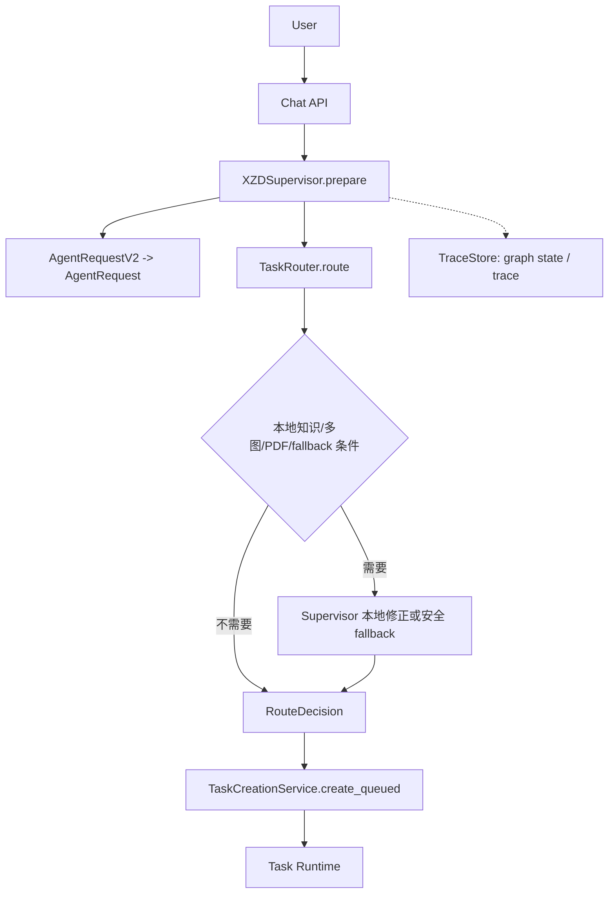

# Supervisor 职责收敛

## 1. 结论

`XZDSupervisor` 保留，但职责收敛为 `API Adapter + Legacy Compatibility Layer + Trace Compatibility`。

它不再作为未来 Agent 控制面的扩展点。课程识别、意图识别和 Agent 选择的现有逻辑在本阶段只冻结，不新增规则；未来由 Planner 统一接管目标理解与计划生成。

处理分类：

| 对象 | 处理 | 说明 |
| --- | --- | --- |
| `XZDSupervisor` | KEEP | 保持 `/chat` 入口兼容、请求转换和 trace 兼容 |
| `_course`、`_intent` | FREEZE | 保留旧协议行为，不继续堆叠关键词和分支 |
| `prepare()` 中的输入规范化 | KEEP | 只做 `AgentRequestV2 -> AgentRequest` 和文件元数据转换 |
| `prepare()` 中的业务路由 | MERGE（未来） | 现阶段由 `TaskRouter` 兼容执行，未来迁移到 Planner |
| Supervisor 专属业务状态 | REMOVE（未来） | 不建立第二套任务状态；使用 Task/AgentRun/Trace 事实源 |

## 2. 当前真实路径



当前 Supervisor 仍直接参与以下判断：

- `_course()` 从 payload、关键词和 session context 推导课程；
- `_intent()` 从 hint、文本 marker 和 session context 推导意图；
- `TaskRouter.route()` 之后按知识库开关、多图/PDF 和 fallback 条件再次改变 route；
- 将 `RouteDecision` 写入 `PreparedTask` 与 trace。

这造成入口层和 Router 同时参与任务理解，也使 `/chat` 与 `/tasks` 的 route 事实可能来自不同路径。

## 3. Phase A 边界

### 保留

1. `AgentRequestV2` 到稳定 `AgentRequest` 的协议转换。
2. 附件引用、输入类型和请求元数据的规范化。
3. 现有 `TraceStore` 的 trace identity 与兼容字段。
4. 安全 fallback 的 fail-closed 行为。

### 冻结

1. 课程和意图 keyword 表只允许修复兼容性问题，不增加新的智能分支。
2. Supervisor 不调用 Provider，不执行 Task，不等待 Runtime。
3. Supervisor 不生成独立的 Plan、Memory 或 Skill 状态。

### 未来迁移

```text
Chat API
  -> Supervisor (协议/trace adapter)
  -> Planner (目标理解与计划；未来阶段)
  -> TaskRouter (deterministic preflight)
  -> Runtime
```

Planner 接入时，Supervisor 仍保留同一入口和 trace 字段；仅把智能判断的 owner 从 Supervisor 移出，避免一次性改动 Chat API。

## 4. 兼容性要求

- 不改变 `Chat API`、`AgentRequestV2`、`AgentRequest`、`RouteDecision` 和 SSE event protocol。
- `PreparedTask.request`、`PreparedTask.route`、`PreparedTask.state` 继续可被现有调用方消费。
- Supervisor 的 fallback route 必须仍经过 `TaskRouter`/`AgentRegistry` 的能力和可用性校验。
- task 创建保持非阻塞；`prepare()` 不得执行 Provider 或 Runtime。

## 5. 验收

- 现有 Supervisor contract tests、Task API、Chat API 和 trace tests 通过。
- 相同输入在 `/chat` 与 `/tasks` 的最终 route/plan 事实可追溯。
- 新增课程或业务 Agent 不通过 Supervisor 增加独立规则；应先进入 Registry/Router 兼容契约，后续由 Planner 设计承接。
