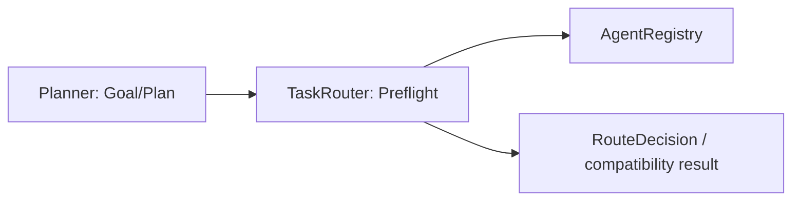

# TaskRouter 冻结与 Preflight 边界

## 1. 结论

`TaskRouter` 保留为 `Deterministic Preflight Adapter`。本阶段不删除、不重写、不继续扩展它，但冻结其智能路由能力，明确未来 Planner 的接入位置。

处理分类：

| 对象 | 处理 | 说明 |
| --- | --- | --- |
| `TaskRouter` | KEEP | 作为现有 `RouteDecision` 兼容入口 |
| registry/capability/input/version 校验 | KEEP | 路由前置安全门 |
| `_score()`、课程/意图启发式分支 | FREEZE | 只维护缺陷和兼容性，不增加新任务理解规则 |
| `overall_route_candidates()` / `apply_overall_route()` | FREEZE | 为过渡期 Overall Router 提供受限候选和校验 |
| 任务分解、复杂规划、Skill 选择 | REMOVE（Router owner） | 未来归 Planner；本阶段不实现 |

## 2. 当前职责审计

当前 `route()` 的实际顺序大致为：

1. `IntentRecognitionService.recognize()` 生成结构化识别结果；
2. `_route_legacy()` 提取材料、识别课程、输入类型和候选 Agent；
3. 对研究、教学、视觉、知识问答、作业等场景执行多个特殊分支；
4. 根据 `AgentRegistry` 和 routing YAML 生成 `RouteDecision`；
5. `_attach_intent_context()` 将 capabilities、selected tools/skills、complexity 等附加到 route。

因此当前 Router 不只是 preflight，还承担了目标理解和 Agent 选择。Phase A 不立即删掉这些分支，原因是它们仍影响旧 Task API、fallback、route lineage 和已有测试；但从现在开始不增加新 owner。

## 3. Frozen contract

```text
Input:  AgentRequest + AgentRegistry snapshot + Settings
Output: RouteDecision

RouteDecision 必须至少保留：
- agent_id / scene / course_id / intent
- route_status / route_source / route_confidence
- availability / fallback_used / original_agent_id
- reason_codes / route_revision / route_trace
- intent_recognition / capabilities / selected_tools / selected_skills
```

允许的 preflight 行为：

- 输入类型、附件和课程能力匹配；
- Agent 是否注册、启用、发布、版本兼容；
- 当前 Agent 是否支持 intent、role、input mode；
- provider/RAG/tool 可用性检查；
- 基于已注册 fallback 的安全降级；
- 记录 route revision、reason codes 和候选 lineage。

禁止的新增行为：

- 让 Router 生成多步任务计划；
- 让 Router 独立调用模型完成总体路由；
- 让 Router 直接执行 Provider、RAG 或 Tool；
- 让 Router 建立长期 Memory 或运行时状态；
- 用新 keyword 分支替代 Planner 设计。

## 4. 与未来 Planner 的关系



未来 Planner 可产生候选 goal、Agent、Skill、Tool 和 plan；TaskRouter 只验证候选是否可以执行，并返回兼容的 `RouteDecision`。Planner 不应绕过 Router 直接启动 Runtime。

## 5. 兼容性与验收

- 不改变 `TaskRouter.route()` 的方法签名和 `RouteDecision` 序列化字段。
- 不改变 Task API、Chat API、Agent Registry、RAG/Tool 接口。
- 现有 route、fallback、SSE 顺序、retry/resume tests 必须通过。
- 任何新的路由能力先记录为 design，不在本 Phase A 追加代码分支。
