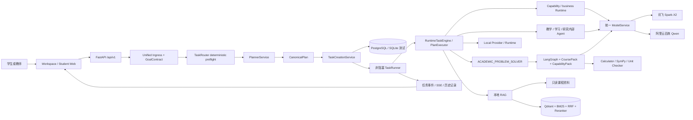

# 芯智导学仓库完整梳理

本文档描述当前可执行仓库的框架、功能、运行链、目录职责、数据边界和扩展方式。逐个可发布文件的功能见配套的 [仓库逐文件目录](repository_file_catalog.md)；准备继续 coding 时使用 [代码级开发手册](developer_code_navigation.md)，其中包含入口、调用链、配置点、常见修改路径和排错顺序。逐文件目录由脚本从 Git 可见范围生成，确保新增、删除或隔离文件后可以自动检查漂移。

## 1. 梳理范围与结论

- 范围：仓库根目录下所有 Git 已跟踪文件，以及未被 `.gitignore` 排除、准备随本轮发布的文件。
- 不在范围：本机 `.env`、真实密钥、教材原文、Qdrant/知识索引、模型缓存、上传物、数据库、测试临时目录和 Python/Node 缓存。
- 当前形态：一个 FastAPI 单体应用承载 API、任务生命周期、自动路由、Supervisor、本地多学科 Agent、本地 RAG、模型 Provider 和静态 Web 页面。
- 核心原则：继续复用唯一的 `POST /api/v1/tasks`、TaskRunner、数据库、SSE、上传和 Provider 链，不建立第二套路由器或任务队列。
- Phase N v2 控制面：新任务使用 `Unified ingress → GoalContract → Planner → CanonicalPlan → Runtime`；TaskRouter 只做 deterministic preflight，旧 Router/Plan/Runtime 仅保留兼容边界。
- 学生入口：`/workspace` 和 `/student` 使用一个自然语言输入自动选择能力，不暴露 Provider 和内部 Agent ID。
- 执行策略：业务任务统一通过本地 Runtime；历史请求中的 `allow_cloud` 仅作为兼容字段接收并丢弃，不会启用远程工作流。
- 历史策略：有审计价值但退出活动架构的文件进入 `archive_legacy/`，不参与导入、测试发现、Docker 构建或 Agent 注册。

## 2. 系统框架



### 2.1 分层职责

| 层 | 主要目录 | 职责 |
|---|---|---|
| 展示层 | `apps/api/app/static/debug/` | 首页、学生端、Workspace、演示中心、系统状态、RAG/Agent/执行调试；本地 KaTeX 公式渲染。 |
| API 层 | `apps/api/app/api/v1/`、`main.py` | HTTP 合同、页面入口、依赖获取、统一异常处理和应用生命周期。 |
| 任务层 | `services/task_*`、`repositories/`、`models/` | 创建、查询、取消、重试、事件序列、会话历史和持久化。 |
| 编排层 | `agents/`、`orchestrator/` | 快速路由、Supervisor、内部 Agent Hub、LangGraph 图工厂和状态合同。 |
| 专业能力层 | `courses/`、`capabilities/`、`tools/` | CT/AE/DE/SS 课程包、共享专业能力、计算器、符号求解和单位校验。 |
| 知识层 | `services/knowledge_*`、`rag_*`、`providers/embedding/` | 资料发现、文本/图像检索、上下文组装、证据质量、引用校验和 RAG 调试。 |
| 模型与运行时层 | `providers/llm/`、`providers/local.py`、`providers/mock.py` | Spark、Qwen、OpenAI-compatible 接口、本地 Agent Runtime 和明确标识的开发 Mock。 |
| 数据与基础设施层 | `database/`、`alembic/`、`docker-compose.yml` | SQLAlchemy 会话、增量迁移、PostgreSQL、Redis、MinIO 和 Qdrant。 |
| 评测与治理层 | `evaluation/`、`app/evaluation/`、`docs/reviews/` | 多学科题集、自动路由、RAG、模型 Agent、HIGH_RISK 校验、报告和基线比较。 |

## 3. 主要运行链

### 3.1 页面与会话

1. 浏览器访问 `/workspace`，静态页面通过 `POST /api/v1/sessions` 创建或恢复会话。
2. 页面提交自然语言、课程提示和可选附件，不要求学生选择 Agent。
3. 会话任务通过 `GET /api/v1/sessions/{session_id}/tasks` 恢复，页面可滚动查看历史。
4. 公式字段由后端 `math_formatting_service.py` 统一规范化，再由前端本地 KaTeX 渲染；非法 LaTeX 保留原文。

### 3.2 任务创建与事件

1. `POST /api/v1/tasks` 由 `TaskCreationService` 校验会话、附件和输入并写入数据库。
2. HTTP 立即返回 `202`；Provider 不在路由请求线程内执行。
3. `TaskRunner` 在进程内异步执行，依次写入带递增 `sequence` 的 queued、running、节点进度和终态事件。
4. 客户端可轮询任务、读取事件或通过 SSE 断点续传；取消与重试仍复用同一任务协议。
5. `TaskPresentation` 把内部结果转换为学生可读回答、能力标签、证据摘要和安全边界。

### 3.3 自动路由与随机问题兜底

1. 本地快速路由先判断课程、任务族、附件类型和风险级别。
2. 多学科专业求解进入 `ACADEMIC_PROBLEM_SOLVER`；课程知识问答进入本地知识/RAG 链；教学与研究请求进入相应内部 Agent。
3. 没有课程领域线索的日常常识、生活、语言和一般科普问题直接进入 `GENERAL_QUESTION_V1`，优先使用 Spark，自然简洁作答；Spark 不可用时才回退 Qwen 快速模型。
4. 通用问答如果达到输出 Token 上限，会自动执行一次续写并合并，避免直接把半截答案作为完成结果。
5. 低置信路由不再等同于“拒绝回答”；只有输入不完整、附件不支持或安全边界触发时才返回明确限制。

### 3.4 多学科求解

`ACADEMIC_PROBLEM_SOLVER` 是 CT（电路理论）、AE（模拟电子技术）、DE（数字电子技术）和 SS（信号与系统）的统一入口。Supervisor 选择课程包，GraphFactory 创建同一求解图，图内按需调用模型与确定性工具。`SOLVER_CT_V1` 作为冻结的历史基线只读保留，不作为当前本地 Runtime 的外部回退。

### 3.5 本地 RAG

1. `KnowledgeBaseService` 只读发现课程资料，不修改教材原文。
2. 文本使用 BGE dense + BM25 sparse，图片使用 SigLIP2；Qdrant 保存命名向量。
3. RRF 融合候选，BGE reranker 重排；模型不可用时进入明确 degraded/failed，不伪造真实 Embedding。
4. `RetrievalContextService` 计算证据充分度并构造同一任务共享的上下文包。
5. Solver 资料只作为方法参考；最终引用由 CitationValidator 校验，不能把检索命中冒充答案正确性。

### 3.6 云端与降级

- Spark/Qwen 通过统一 `ModelService` 调用，错误、超时和追踪信息统一脱敏。
- 历史请求中的 `options.allow_cloud` 在合同校验阶段被移除；它不能改变本地 Provider、Runtime 或路由选择。
- Provider HTTP 200 或 workflow complete 只说明调用完成，不代表回答质量验收通过。
- Mock 结果始终带明确 Mock 标识，不描述为真实云端结果。

## 4. 当前功能清单

| 能力 | 状态 | 入口/实现 | 边界 |
|---|---|---|---|
| 学生统一工作台 | 活动 | `/workspace`、`workspace.*` | 单输入自动路由，隐藏内部实现名。 |
| 学生简化入口 | 活动 | `/student` → `workspace.*` | 支持文字、多图、历史与证据展示。 |
| 通用随机问答 | 活动 | `GENERAL_QUESTION_V1` | 不要求命中课程路由；统一使用本地 Runtime。 |
| 多学科专业求解 | 活动 | `ACADEMIC_PROBLEM_SOLVER` | CT/AE/DE/SS 共享图，不伪造缺失题设。 |
| 电路冻结基线 | 保留 | `SOLVER_CT_V1` | 只读历史审计基线，不参与当前运行时路由。 |
| 教学任务 | 活动 | 备课、作业初审内部 Agent | 复用任务上下文与本地资料。 |
| 学习问答 | 活动 | Knowledge QA / Local Retrieval | 明确区分课程证据、方法参考和无资料回答。 |
| 有限诊断与分级辅导 | 活动 | TeachingPlanner / Verification / Hint / Disclosure | 三模式；H0—H2；复杂过程转人工复核，不自动评分。 |
| 研究任务 | 活动 | 学术写作、数据分析内部 Agent | 没有可信来源/数据时只给计划并说明限制。 |
| HIGH_RISK 校验 | 活动 | `high_risk_verification.py` | 对高风险结果执行更严格的协议校验与治理。 |
| 数学公式 | 活动 | `math_formatting_service.py` + KaTeX | 结构化公式优先，失败显示原始 LaTeX。 |
| 本地多模态 RAG | 活动 | `rag_retrieval.py` 等 | 原始资料与索引留在本机，不进 Git。 |
| 任务生命周期 | 活动 | tasks API + TaskRunner | 非阻塞创建、事件、SSE、取消、重试。 |
| 文件与产物 | 活动 | files/artifacts API + StorageService | MinIO 可用时使用对象存储，开发态允许本地回退。 |
| 调试与可观测 | 活动 | `/debug/*`、traces、execution | 只暴露脱敏摘要，不暴露密钥。 |
| 真实评测闭环 | 活动 | `evaluation/` + scripts + API | 区分本地、Mock 和真实模型证据。 |

## 5. HTTP 与页面入口

| 入口 | 用途 |
|---|---|
| `/` | 产品首页与能力导航。 |
| `/workspace` | 推荐的学生统一工作台。 |
| `/student` | 兼容的学生简化页面。 |
| `/demo?presentation=1` | 演示中心与会议展示模式。 |
| `/system` | 服务、Provider 与依赖状态。 |
| `/debug`、`/debug/rag`、`/debug/agents`、`/debug/execution` | 开发/管理员调试页面。 |
| `POST /api/v1/tasks` | 核心非阻塞任务创建。 |
| `GET /api/v1/tasks/{task_id}` | 查询任务状态与最终结果。 |
| `GET /api/v1/tasks/{task_id}/events` | 查询有序任务事件。 |
| `GET /api/v1/tasks/{task_id}/events/stream` | SSE 事件流与重连。 |
| `POST /api/v1/chat`、`POST /api/v1/chat/stream` | 复用既有任务链的对话入口。 |
| `/api/v1/knowledge/*` | 资料状态、检索、健康、受控文件读取和基准摘要。 |
| `/api/v1/models/*` | 模型注册状态与可选真实健康检查。 |
| `/api/v1/agents/*`、`/api/v1/internal-agents` | 脱敏 Agent 状态、dry-run 和内部注册信息。 |

完整且可机器读取的接口合同在 `docs/api/openapi.json`，路由源码位于 `apps/api/app/api/v1/`。

## 6. 顶层目录与文件

```text
xinzhi-daoxue/
├─ agent_configs/          # Agent 注册、Mock 配置、CoursePack、冻结基线
├─ apps/
│  ├─ api/                 # FastAPI 主应用、迁移、测试、静态 Web
│  └─ worker/              # 未来独立 Worker 的边界说明，不是第二运行时
├─ archive_legacy/         # 退出活动架构的历史隔离区
├─ config/                 # 国产模型及角色路由配置
├─ docs/                   # 现行设计、运行、评测、报告与截图
├─ evaluation/             # 可复现评测用例、模式、基线与运行脚本
├─ knowledge_config/       # 课程映射、同义词、OCR 修订与索引配置模板
├─ local_knowledge/        # 可提交的课程目录占位和说明
├─ scripts/                # 启动、诊断、索引、评测、校验和烟测
├─ tests/                  # 仓库级配置与静态边界测试
├─ docker-compose.yml      # 本地基础设施与 API 编排
├─ xzd.cmd / xzd.ps1/.sh  # 统一跨平台入口
└─ 打开芯智导学.cmd        # Windows 双击启动并打开网页
```

### 6.1 `apps/api/app/` 子目录

| 子目录 | 功能 |
|---|---|
| `agents/` | 顶层 Agent 注册、快速路由、内部从属 Agent 和冻结 CT 兼容图。 |
| `api/v1/` | REST/SSE 接口；每个资源一个小路由模块。 |
| `capabilities/` | 可复用能力包合同与注册表。 |
| `contracts/` | Agent、API、模型、路由、运行时、求解和数学内容 Pydantic 合同。 |
| `core/` | Settings、日志、脱敏、错误和内部 Runtime 元数据。 |
| `courses/` | CT/AE/DE/SS CoursePack 接口与注册表。 |
| `database/` | SQLAlchemy Base、异步引擎和会话。 |
| `evaluation/` | 评测用例加载、缓存、评分、报告与运行器。 |
| `integrations/` | 明确保留的第三方集成扩展点；当前没有独立运行逻辑。 |
| `models/` | 数据库实体。 |
| `multimodal/` | 图片输入解析、验证、多图拼接和复杂批次逐图降级合同。 |
| `observability/` | 模型调用追踪与内存 TraceStore。 |
| `orchestrator/` | Supervisor、GraphFactory、学术求解 LangGraph 和共享状态。 |
| `providers/` | Agent、LLM、Embedding、Vision、本地 Runtime 和 Mock Provider。 |
| `repositories/` | Session、Task、Event、File、Artifact 数据访问。 |
| `services/` | 任务、模型、知识、RAG、治理、展示和专业求解业务服务。 |
| `static/debug/` | 无前端构建步骤的 HTML/CSS/JS 页面、本地 KaTeX 和字体。 |
| `tools/` | 确定性计算、SymPy 方程求解、单位校验和工具注册。 |

### 6.2 配置来源优先级

1. `apps/api/app/core/config.py` 定义所有 Settings、默认值、范围和环境变量名。
2. `.env.example` 只提供空值或安全默认模板；本机 `.env` 优先并被 Git 忽略。
3. `config/models.yaml` 定义模型；`config/model_routes.yaml` 定义角色到模型的路由。
4. `agent_configs/registry.yaml` 定义顶层 Agent 和工作流能力；`course_packs/` 定义课程包；冻结 CT 配置不得直接修改。
5. `knowledge_config/` 定义课程资料覆盖层；只有人工批准项进入运行时。
6. `config/skills/` 和 `config/error_pool/` 定义 CT/AE/DE 的版本化教学元数据；
   它们只做确定性适配和精确规则匹配，不替代 CoursePack、Solver 或 RAG。

### 6.3 评测结构

- `evaluation/cases/academic_solver/`：CT/AE/DE/SS 多学科求解用例。
- `evaluation/cases/boundary/`：缺少条件、错路由和降级边界。
- `evaluation/cases/teaching_foundation/`：学生作答、模式、解题包、证据包、技能与错因的 synthetic 合同案例。
- `evaluation/automatic_routing/`：自然语言自动选路固定样例。
- `evaluation/circuit_theory/`：冻结 CT 基准、Schema、样例和汇总脚本。
- `evaluation/knowledge_retrieval/`：三课程检索基准与可比较结果。
- `evaluation/model_agents/`：内部模型 Agent 真实/干跑用例。
- `apps/api/app/evaluation/`：统一加载、打分、缓存和报告实现。

## 7. 数据与敏感边界

| 数据 | 本机位置 | 是否上传 GitHub | 原因 |
|---|---|---:|---|
| API Key、Secret | `.env` | 否 | 模型与基础设施凭据。 |
| 安全配置模板 | `.env.example` | 是 | 只含空值和非敏感默认值。 |
| 原始教材 | `电路理论/`、`模电/`、`数电/`、`知识库/` | 否 | 版权、体积与本机路径差异。 |
| 向量/词法索引 | `knowledge_indexes/`、Qdrant volume | 否 | 可重建运行数据。 |
| 上传与产物 | `local_storage/` 或 MinIO volume | 否 | 用户数据与运行产物。 |
| 数据库/缓存 | Docker volumes、测试 SQLite、Redis | 否 | 状态数据，不属于源码。 |
| 评测样例与无隐私基线 | `evaluation/` | 是 | 可复现验证所需。 |
| UI 截图 | `docs/reviews/` | 是 | 视觉验收证据，不含学生隐私。 |

## 8. 已隔离的冗余逻辑

### 8.1 本轮证据

活动目录原有 `apps/api/app/services/task_service.py` 只做一件事：把 `TaskQueryService` 别名为旧名称 `TaskService`。全仓库引用检查确认除文件自身外没有调用；API、依赖注入、TaskRunner 和测试均直接使用拆分后的服务。因此它已移至：

```text
archive_legacy/apps/api/app/services/task_service.py
```

隔离后的文件不在 `app` 包内、不会进入 Python wheel、不会被测试发现，也不会进入 Docker 活动代码复制路径。`test_legacy_cleanup.py` 固化了“活动路径不存在、隔离路径存在”的回归条件。

### 8.2 既有隔离

阶段 0—2.2 的历史架构快照、评审报告和包含未发布 Agent 的旧工作流计划位于 `archive_legacy/docs/`。它们用于审计，不作为当前能力和配置依据。

### 8.3 未判定为冗余的轻量文件

- `__init__.py`：定义包边界与稳定导出。
- `providers/llm/spark.py`、`providers/local.py`：受控 Provider 公共入口；本地 Runtime 不依赖外部工作流。
- `integrations/__init__.py`：明确的可扩展集成边界。
- `apps/worker/README.md`：记录未来拆分边界，不启动第二运行时。
- Alembic migration：即使逻辑已被新版本覆盖也必须保留，不能修改历史迁移。
- `SOLVER_CT_V1`：冻结历史基线，按仓库规则原样保留，不作为当前执行能力。

隔离详情和判据见 [旧文件与功能清理记录](legacy_cleanup_report.md)。

## 9. 启动与验证

### 9.1 Windows 推荐启动

首次运行先启动 Docker Desktop，然后双击 `打开芯智导学.cmd`。命令行等价方式：

```powershell
.\xzd.cmd doctor
.\xzd.cmd start
```

开发热重载：

```powershell
.\xzd.cmd start -Reload
```

默认地址为 `http://127.0.0.1:8000/workspace`。启动器只执行本地依赖检查和 Runtime Preflight。

### 9.2 完整校验

```powershell
.\scripts\check.ps1
```

可拆分执行：

```powershell
.\.venv\Scripts\python.exe -m ruff check apps/api/app apps/api/tests scripts tests
.\.venv\Scripts\python.exe -m mypy apps/api/app
.\.venv\Scripts\python.exe -m pytest apps/api/tests -q --no-cov
.\.venv\Scripts\python.exe scripts\validate_config.py
.\.venv\Scripts\python.exe scripts\check_sensitive_files.py
.\.venv\Scripts\python.exe scripts\generate_repository_catalog.py --check
```

真实模型和完整多模态索引属于外部依赖验收，必须单独报告，不能用本地单元测试结果替代。

## 10. 扩展方式

- 新课程：增加 CoursePack 和评测用例，通过 CourseRegistry 注册；不复制求解图。
- 新能力：实现 CapabilityPack 或 Tool，并通过注册表加入 GraphFactory。
- 新内部 Agent：实现统一内部合同，注册到 InternalAgentHub，继续作为从属能力。
- 新顶层工作流：更新 `agent_configs/registry.yaml`、输入/输出合同、路由样例和契约测试。
- 新模型：实现统一 LLM Provider，写入 `models.yaml` 和 `model_routes.yaml`，不把 Key 写入配置文件。
- 新数据库字段：只增加新的 Alembic migration，不修改已提交 migration。
- 新 SSE 事件：增加顺序、终态和重连回归测试。
- 新知识数据：必须来自真实执行链或明确的只读课程资料，不能伪造引用、检索命中或云端结果。

## 11. 学习质量闭环与可靠执行扩展

本轮仍以 `POST /api/v1/tasks` 为唯一模型与 Agent 执行入口。在共享 `AcademicProblemSolverGraph` 末端增加确定性 `SolverQualityGateService`，以统一 `SolverResult` 保存结构化最终答案、验证、知识证据与质量门结论；CoursePack 只声明课程特有校验规则，不复制 Solver 图。`SOLVER_CT_V1` 的冻结代码、Prompt 与节点均未修改。

知识层由只读扫描器生成带 `document_version`、相对来源、内容哈希和活动状态的 manifest。内容变化产生新版本和新 chunk id，旧版本及旧 chunk 进入非活动历史；RAG 只装载活动 chunk，失败的向量构建不覆盖上一次成功状态。

学习动作通过 `/api/v1/learning/actions` 保存来源任务、错题、练习和知识点掌握状态。需要进一步生成的“提示、变式、关联讲解”只返回 follow-up prompt，由 Workspace 再提交到原任务 API，不在学习服务内直接调用 Provider。

`TaskExecutor` 是 TaskRunner 前的稳定调度边界。当前 `LocalTaskExecutor` 保持原进程内行为，`QueueTaskExecutor` 仅作为显式未配置扩展点；任务表新增幂等键、最大尝试次数、执行所有者、租约、心跳、取消时间与失败分类。显式重试只接受可重试失败且不得超过 `max_attempts`。

评测继续复用既有 `EvaluationRunner`，支持 `local_deterministic`、`local_mock` 和 `real_model` 三种证据隔离模式。仓库样例标记为 synthetic/not_official；私有真实案例目录默认被 Git 忽略。

## 12. 已知风险与后续检查

- TaskRunner 当前是进程内执行器，适合本地和单实例；多实例部署前需要把执行权迁移到可靠队列，但不能改变现有任务协议。
- 本地 BGE/SigLIP2/Reranker 首次下载和 CPU 推理成本较高；健康页的 200 不等同于所有模型已预热。
- 本地模型回答质量仍需按课程和任务类型做真实验收；配置完整只证明运行边界可用。
- 评测报告应继续注明 local、Mock 和模型 Provider 三种证据层级。
- 每次目录变动后运行目录生成脚本并提交更新，防止本文档与实际仓库漂移。

## 13. 逐文件索引

所有可发布子文件（包含源码、测试、脚本、配置、文档、截图、字体与历史隔离文件）都在 [repository_file_catalog.md](repository_file_catalog.md) 中逐目录列出，并为每个文件给出活动/隔离状态和功能摘要。

## 14. 教学闭环第三阶段

`practice_attempts` 是唯一 Attempt 实体，`learner_knowledge_states` 是唯一
mastery 事实来源。`LearningOutcomeService` 位于 TaskRunner/学习动作与状态表
之间，集中解释配置化证据；TaskRunner 只调用服务，不包含 delta。新增的
`retest_plans` 只保存按需查询的时间计划，不运行 scheduler 或通知。

```text
StudentAttempt → Verification → FeedbackUptake
→ MasteryEvidence → LearnerKnowledgeState → RetestPlan
```

详细边界见 [教学闭环第三阶段](architecture/teaching_loop_phase3.md)。
# 会话运行时层

会话运行时层位于 API 与已有 TaskRunner 之间，职责是将同一用户会话的消息、
WorkingState、版本化摘要和显式长期记忆组装为临时
`ConversationContextBundle`。它与 `RetrievalContextService` 分工：前者管理
对话与偏好，后者仍是唯一 RAG 证据组装服务。两者只在原 TaskRunner 内汇合，
不形成第二条聊天执行链。

Context Cache 只缓存脱敏上下文结构和来源 ID，不缓存最终答案；Provider Prompt
Cache 当前标记为不支持/未启用。`LearnerKnowledgeState` 继续是课程掌握事实来源，
通用 Memory 不复制掌握度。
