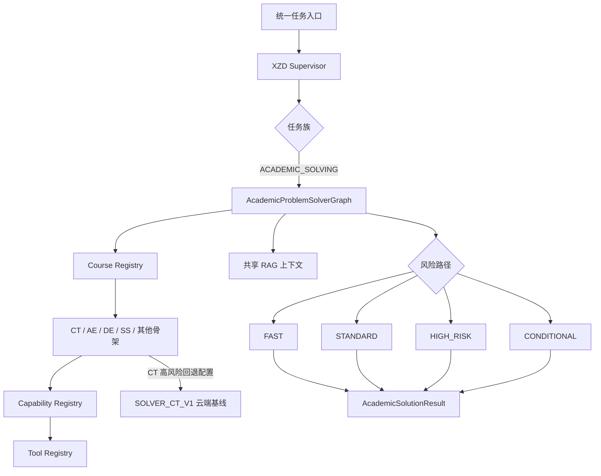

# 通用多学科专业问题求解引擎

`ACADEMIC_PROBLEM_SOLVER` 是唯一专业求解 Agent。课程代码不再直接映射为独立 Agent，而是选择不同 CoursePack。

主图节点由 `AcademicProblemSolverGraph.node_names` 声明：输入归一化、CoursePack 解析、多模态条件节点、结构化、质量/可求解性、题型、能力、RAG、路径、规划、生成、工具、验证、局部修正、学习反馈、格式化和最终响应。

LangGraph 存在时由 `StateGraph(XZDGraphState)` 编译；依赖未安装时保留同语义的确定性执行以便迁移环境给出明确结果。图节点不创建 Provider、向量库或数据库连接。

## 路径与验证

- FAST：高置信度、低冲突、少量确定性方程。
- STANDARD：一般专业题。
- HIGH_RISK：多图、来源冲突、代码或低置信度累积达到阈值。
- CONDITIONAL：关键字段缺失，或课程仅有配置骨架。
- FALLBACK：运行时不可恢复失败；CT 可指向 SOLVER_CT_V1。

路径由 Python 规则和 CoursePack 状态确定，不由模型单独决定。TaskRunner 只检索一次并注入 RetrievalContextPacket。图优先使用共享确定性工具；验证只产生一致性状态和风险，不重新生成完整答案。信息不足时返回缺失字段、假设和置信度，不补造事实。

## 长回答与续答

专业求解单段输出预算由 `ACADEMIC_SOLVER_MAX_TOKENS` 控制，默认 4096；默认最多续答 2 次，因此总输出预算可达 12288 tokens。长题单次等待时间由 `ACADEMIC_SOLVER_TIMEOUT_SECONDS` 控制，默认 240 秒，不沿用分类和视觉任务的短超时。专业长题优先使用 Qwen，Spark 作为后备，避免 Spark 上游对大输出连续返回 504。当 Provider 明确返回长度上限、用量达到预算、长回答末尾存在未闭合公式，或复杂题没有返回全部小问完成标记时，服务会从中断处自动续答；`ACADEMIC_SOLVER_MAX_CONTINUATIONS` 允许配置为 0–4。

续答会保留原题和上一段回答末尾，要求模型重写被截断的最后一句或公式并完成剩余小问。达到续答上限仍未闭合时，破损尾部会被移除，`model_execution.output_status` 标记为 `partial`，前端展示“部分生成”；HIGH_RISK 二次审核会延后，避免审核不完整答案。每段的 `finish_reason`、累计用量与实际模型调用次数会写入结构化执行记录。
